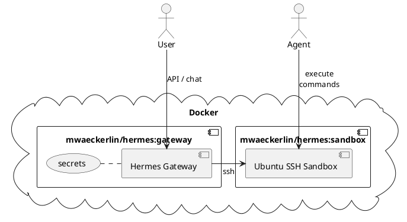
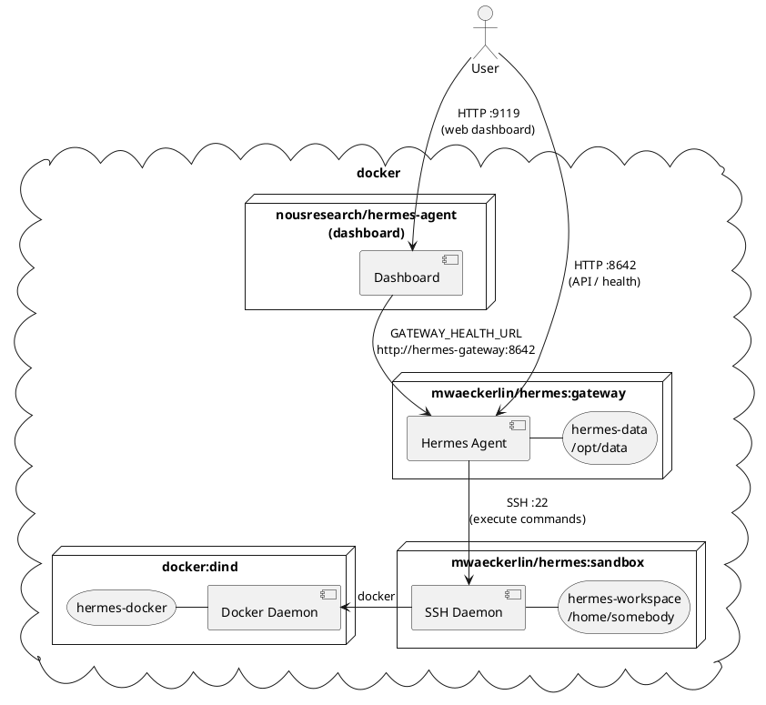

# Simple Secure Hermes in SSH Sandbox

Combine Hermes with security and ease of use! Run a fully sandboxed
[NousResearch Hermes agent](https://github.com/NousResearch/hermes-agent)
out of the box — locally or in a cloud.

**It has never been so easy to run a *secure* sandboxed Hermes!**:
1. get an API key (e.g. [OpenRouter](https://openrouter.ai/keys), [Anthropic](https://console.anthropic.com/), or [OpenAI](https://platform.openai.com/api-keys))
2. write some [configuration variables in `.env`](#local-development-setup)
3. run `npm start`
4. open the dashboard: [`http://localhost:9119/`](http://localhost:9119/)

Port 8642 is the OpenAI-compatible API and health endpoint (`/healthz`). The web dashboard runs as a separate service on port 9119.

Or connect a chat platform (Telegram, Discord, Slack) and skip the HTTP ports entirely.

**Target audience:** Security-aware **developer** with basic Docker know-how.


<details>
<summary>PlantUML source</summary>



</details>

## Security Model

The primary security mechanism is **strict isolation**: the AI runs in a dedicated
sandbox container that has no access to the gateway's secrets, host files, or
production data.

### Container Segregation

- **Isolated sandbox** — the gateway controls all secrets. The agent executes
  commands inside the sandbox via SSH. No API keys, no LLM tokens, and no gateway
  configuration are accessible from the sandbox.
- **Container hardening** — `no-new-privileges` and `pids_limit: 256` prevent
  privilege escalation and fork bombs.

### Network Isolation

- **Segregated networks** — each container pair communicates on its own internal
  Docker network. The gateway and sandbox share `gateway-sandbox`; the sandbox
  and the Docker-in-Docker daemon share `sandbox-dind`. No cross-network traffic.
- **Network encryption** (production) — encrypt overlay networks when deploying
  to Docker Swarm: set `networks.<name>.driver_opts.encrypted: "true"` on each
  network, or add a service mesh.
- **Minimal port exposure** — only port 8642 (gateway API) is published for local
  testing. If you use a chat platform such as Telegram you can close that port
  entirely. *Do not expose port 8642 to the Internet without a TLS reverse proxy.*

### Secrets

- **Docker Secrets** (production) — use `docker secret` instead of environment
  variables. The gateway entrypoint reads every file in `/run/secrets/`, uppercases
  the filename, and exports it as an environment variable. Example:
  `/run/secrets/hermes_sandbox_ssh_private_key` → `HERMES_SANDBOX_SSH_PRIVATE_KEY`.

### Docker-in-Docker

Optional isolated Docker daemon for the sandbox. Gives the agent full root inside
the DinD container. The host Docker daemon is completely separate.

## Full Architecture


<details>
<summary>PlantUML source</summary>



</details>

## Local Development Setup

For local testing with `docker compose` and a `.env` file.

### 1. Generate SSH Keypair and `.env`

```bash
ssh-keygen -t ed25519 -f hermes-key -N "" -C "hermes-sandbox"
cat > .env <<EOF
HERMES_SANDBOX_SSH_PUBLIC_KEY=$(cat hermes-key.pub)
HERMES_SANDBOX_SSH_PRIVATE_KEY=$(sed -z 's/\n/\\n/g' hermes-key)
OPENROUTER_API_KEY=sk-or-...[YOUR-OPENROUTER-KEY]
EOF
rm hermes-key hermes-key.pub
```

You can also use a direct provider key:

```bash
# Anthropic
ANTHROPIC_API_KEY=sk-ant-...

# OpenAI
OPENAI_API_KEY=sk-...

# Google Gemini
GOOGLE_API_KEY=AIza...
```

The gateway entrypoint auto-selects the default model from whichever key is set
(priority: OpenRouter → Anthropic → Google → OpenAI). Override with
`HERMES_DEFAULT_MODEL`.

### 2. Start

**In foreground (see logs in real-time):**
```bash
npm start
```

**In background (daemon mode):**
```bash
npm run start:daemon
```

Gateway API / health: `http://localhost:8642/healthz`  
Dashboard (web UI): `http://localhost:9119/`

**Local / trusted-network use only.** Do not expose these ports to the Internet
without a TLS reverse proxy.

## Full Configuration Guide

### Automatic Secret Mapping

The gateway entrypoint reads every file under `/run/secrets/` and exports it as
an environment variable. Filename is uppercased, dashes replaced by underscores:

| Docker secret name | Environment variable |
|---|---|
| `hermes_sandbox_ssh_private_key` | `HERMES_SANDBOX_SSH_PRIVATE_KEY` |
| `openrouter_api_key` | `OPENROUTER_API_KEY` |
| `telegram_bot_token` | `TELEGRAM_BOT_TOKEN` |
| … | … |

Any Docker Secret is automatically available — no explicit mapping required.

### Core Variables

| Variable | Required | Description |
|---|---|---|
| `HERMES_SANDBOX_SSH_PUBLIC_KEY` | **yes** | Ed25519 public key for sandbox SSH access |
| `HERMES_SANDBOX_SSH_PRIVATE_KEY` | **yes** | Private key (`\n`-encoded), gateway → sandbox |

### LLM Providers

All optional — configure one or more. If none is set the gateway exits with an error on startup.

| Variable | Description |
|---|---|
| `OPENROUTER_API_KEY` | OpenRouter — access to 300+ models via one key. Auto-selects **claude-opus-4-5**. See note below. |
| `ANTHROPIC_API_KEY` | Direct Anthropic (Claude) |
| `OPENAI_API_KEY` | Direct OpenAI. Auto-selects **o4-mini** (a reasoning model). See note below. Also used for Whisper/TTS if `VOICE_TOOLS_OPENAI_KEY` is unset |
| `GOOGLE_API_KEY` / `GEMINI_API_KEY` | Google Gemini |
| `LITELLM_BASE_URL` | LiteLLM proxy URL (OpenAI-compatible, e.g. `http://litellm:4000`) |
| `LITELLM_API_KEY` | API key for the LiteLLM proxy (optional) |
| `LITELLM_DEFAULT_MODEL` | Default model served by LiteLLM (default: `gpt-4o`) |
| `HERMES_DEFAULT_MODEL` | Override auto-selected default (e.g. `anthropic/claude-opus-4.6`) |

> **OpenRouter — model ID naming**
>
> OpenRouter uses **hyphenated** version suffixes in model IDs, which differ from
> the dot notation used by the Anthropic API. For example, the Anthropic API model
> `claude-opus-4.6` is listed on OpenRouter as `anthropic/claude-opus-4-5`
> (or the closest available version). Using the dot notation with OpenRouter will
> fail with:
>
> ```
> HTTP 400: openrouter/anthropic/claude-opus-4.6 is not a valid model ID
> ```
>
> The gateway auto-selects `openrouter/anthropic/claude-opus-4-5` when
> `OPENROUTER_API_KEY` is set. To use a different model, override with
> `HERMES_DEFAULT_MODEL=openrouter/<openrouter-model-id>`. Check
> <https://openrouter.ai/models> for available model IDs.

> **OpenAI — organization verification required for reasoning models**
>
> When `OPENAI_API_KEY` is set, Hermes auto-selects **o4-mini** as the default
> model because the Responses API transport always enables reasoning
> (`reasoning.encrypted_content`), which non-o-series models (e.g. `gpt-4o`)
> reject with HTTP 400.
>
> o4-mini is an OpenAI reasoning model and requires your OpenAI **organization
> to be verified** before it can generate reasoning summaries. Without
> verification you will see:
>
> ```
> HTTP 400: Your organization must be verified to generate reasoning summaries.
> ```
>
> **Fix:** go to <https://platform.openai.com/settings/organization/general>
> and click **Verify Organization**. Access propagates within ~15 minutes.
>
> If you cannot or do not want to verify, use a different provider (OpenRouter,
> Anthropic, or Google Gemini) instead of a bare `OPENAI_API_KEY`.

### Messaging Channels

Channels are enabled by setting the corresponding token. No explicit `enabled: true` needed.

| Variable | Description |
|---|---|
| `TELEGRAM_BOT_TOKEN` | Telegram bot token (from @BotFather) |
| `TELEGRAM_ALLOWED_USERS` | Comma-separated Telegram user IDs (default: open) |
| `TELEGRAM_HOME_CHANNEL` | Default chat for cron job notifications |
| `TELEGRAM_WEBHOOK_URL` | Switch to webhook mode (cloud deployments) |
| `DISCORD_BOT_TOKEN` | Discord bot token |
| `SLACK_BOT_TOKEN` | Slack bot OAuth token (`xoxb-…`) |
| `SLACK_APP_TOKEN` | Slack app-level token for Socket Mode (`xapp-…`) |
| `SLACK_ALLOWED_USERS` | Comma-separated Slack user IDs |
| `WHATSAPP_ENABLED` | `true` to enable. Run `hermes whatsapp` to pair. |
| `WHATSAPP_ALLOWED_USERS` | Comma-separated phone numbers |
| `GATEWAY_ALLOW_ALL_USERS` | `true` = open access (no allowlist). Default: `false` |

When a new user contacts the bot for the first time, they receive a random pairing
code and are asked to pass it to the bot owner for approval. To approve (or revoke)
users, open the **Dashboard → Pairing** tab at `http://localhost:9119/pairing`.
The Pairing tab lists all pending codes with one-click **Approve** buttons, and
shows all approved users with **Revoke** buttons. No CLI required.

### Tool API Keys

| Variable | Description |
|---|---|
| `VOICE_TOOLS_OPENAI_KEY` | Whisper STT + OpenAI TTS. Defaults to `OPENAI_API_KEY` if unset. |
| `GROQ_API_KEY` | Groq free-tier Whisper STT |
| `EXA_API_KEY` | Exa web search |
| `FIRECRAWL_API_KEY` | Firecrawl web scrape / crawl |
| `PARALLEL_API_KEY` | Parallel web extract |
| `FAL_KEY` | fal.ai image generation |
| `BROWSERBASE_API_KEY` | Browserbase cloud browser automation |
| `BROWSERBASE_PROJECT_ID` | Browserbase project ID |
| `ELEVENLABS_API_KEY` | ElevenLabs premium TTS |
| `GITHUB_TOKEN` | GitHub token (Skills Hub + higher rate limits) |

### config.yaml — Section-Level Overrides

The gateway renders `files/config.yaml.j2` (Jinja2 template) into
`/opt/data/config.yaml` on startup. Each top-level YAML section can be
completely replaced by setting `HERMES_<SECTION>_YAML` to a JSON string
(JSON is valid YAML):

| Variable | config.yaml section |
|---|---|
| `HERMES_MODEL_YAML` | `model:` |
| `HERMES_TERMINAL_YAML` | `terminal:` |
| `HERMES_COMPRESSION_YAML` | `compression:` |
| `HERMES_MEMORY_YAML` | `memory:` |
| `HERMES_SESSION_RESET_YAML` | `session_reset:` |
| `HERMES_STREAMING_YAML` | `streaming:` |
| `HERMES_SKILLS_YAML` | `skills:` |
| `HERMES_AGENT_YAML` | `agent:` |
| `HERMES_PLATFORM_TOOLSETS_YAML` | `platform_toolsets:` |
| `HERMES_STT_YAML` | `stt:` |
| `HERMES_CODE_EXECUTION_YAML` | `code_execution:` |
| `HERMES_DELEGATION_YAML` | `delegation:` |
| `HERMES_MCP_SERVERS_YAML` | `mcp_servers:` |
| `HERMES_DISPLAY_YAML` | `display:` |

Example — add an MCP server:

```bash
HERMES_MCP_SERVERS_YAML='{"time":{"command":"uvx","args":["mcp-server-time"]}}'
```

Example — restrict platform toolsets:

```bash
HERMES_PLATFORM_TOOLSETS_YAML='{"telegram":["web","terminal","file","skills","todo"]}'
```

### config.yaml — Individual Setting Overrides

| Variable | config.yaml path | Default |
|---|---|---|
| `HERMES_DEFAULT_MODEL` | `model.default` | auto-selected |
| `HERMES_MODEL_PROVIDER` | `model.provider` | `auto` |
| `HERMES_MODEL_BASE_URL` | `model.base_url` | — |
| `HERMES_MAX_TURNS` | `agent.max_turns` | `60` |
| `HERMES_GATEWAY_TIMEOUT` | `agent.gateway_timeout` | — (unlimited) |
| `HERMES_GATEWAY_TIMEOUT_WARNING` | `agent.gateway_timeout_warning` | — |
| `HERMES_GATEWAY_DRAIN_TIMEOUT` | `agent.restart_drain_timeout` | — |
| `HERMES_REASONING_EFFORT` | `agent.reasoning_effort` | `medium` |
| `HERMES_AGENT_VERBOSE` | `agent.verbose` | `false` |
| `HERMES_COMPRESSION_ENABLED` | `compression.enabled` | `true` |
| `HERMES_COMPRESSION_THRESHOLD` | `compression.threshold` | `0.50` |
| `HERMES_MEMORY_ENABLED` | `memory.memory_enabled` | `true` |
| `HERMES_USER_PROFILE_ENABLED` | `memory.user_profile_enabled` | `true` |
| `HERMES_SESSION_RESET_MODE` | `session_reset.mode` | `both` |
| `HERMES_SESSION_RESET_IDLE_MINUTES` | `session_reset.idle_minutes` | `1440` |
| `HERMES_GROUP_SESSIONS_PER_USER` | `group_sessions_per_user` | `true` |
| `HERMES_STREAMING_ENABLED` | `streaming.enabled` | `false` |
| `HERMES_SKILLS_NUDGE_INTERVAL` | `skills.creation_nudge_interval` | `15` |
| `HERMES_STT_ENABLED` | `stt.enabled` | `true` |
| `HERMES_DISPLAY_TOOL_PROGRESS` | `display.tool_progress` | `all` |
| `HERMES_DISPLAY_COMPACT` | `display.compact` | `false` |
| `HERMES_DISPLAY_SKIN` | `display.skin` | `default` |

### Config Persistence

`config.yaml` is stored in the `hermes-data` Docker volume (`/opt/data`).
On first start it is rendered from the template. On subsequent starts the
existing file is preserved unless `OVERWRITE_CONFIG` is set.

To force a re-render without losing the volume:

```bash
OVERWRITE_CONFIG=true npm start
```

To edit `config.yaml` directly (advanced):

```bash
docker compose exec hermes-gateway cat /opt/data/config.yaml
docker compose exec hermes-gateway vi /opt/data/config.yaml
```

## Docker-in-Docker (Optional)

The `hermes-dind` service provides an isolated Docker daemon for the sandbox.
Set `DOCKER_HOST=tcp://hermes-dind:2375` in the sandbox (already configured).
Remove the `hermes-dind` service and the `DOCKER_HOST` environment variable
from the sandbox if you don't need it.

**Who needs this?** Developers and DevOps engineers who want Hermes to build,
run, and test containerized applications. For general use (writing, research,
scripting), DinD is not needed.

**Security warning:** The AI has full root access inside the DinD daemon. It can
destroy all images/containers or exhaust disk space on the `hermes-docker` volume.
DinD is isolated from the host Docker daemon, but within its own daemon the AI
has unrestricted access. Enable only if you accept that risk.

### DinD in Docker Swarm

Docker Swarm does not support `privileged: true` in stack deploy files.
Docker-in-Docker is therefore not supported in Swarm mode.

## Production Checklist

- [ ] All secrets via `docker secret`, not environment variables
- [ ] Encrypted overlay network (`--opt encrypted`)
- [ ] Port 8642 behind TLS reverse proxy (nginx, Traefik, Kong) — or not exposed at all when using only chat platforms
- [ ] Port 9119 (dashboard) behind TLS reverse proxy with authentication — or not exposed publicly
- [ ] `GATEWAY_ALLOW_ALL_USERS=false` (default) or explicit `TELEGRAM_ALLOWED_USERS`/`DISCORD_*` allowlists
- [ ] Firewall restricts access to gateway and dashboard ports
