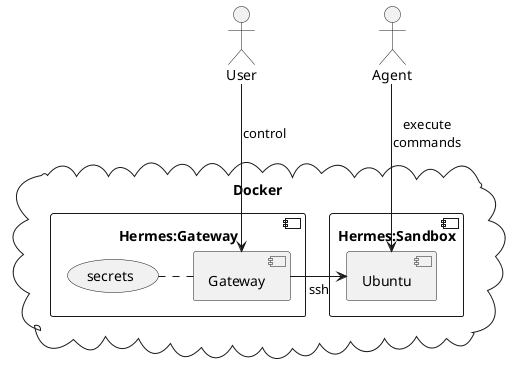
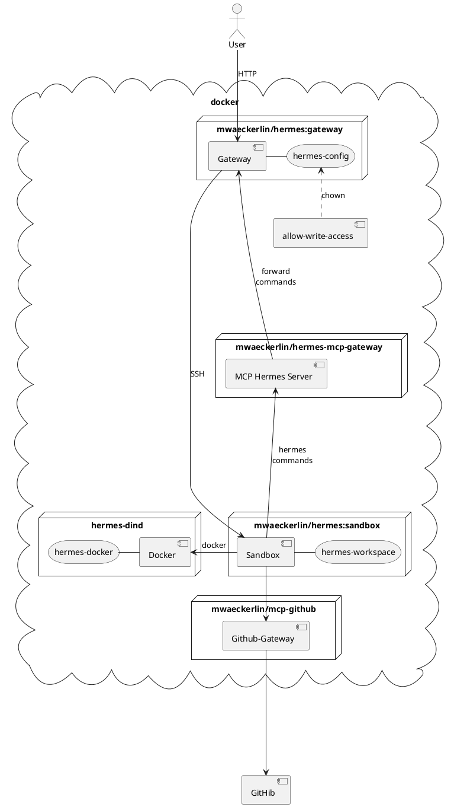

# Simple Secure Hermes in SSH Sandbox


Combine Hermes with Security and Easiness! Run out of the box a secure docker based sandboxed Hermes, locally or in a cloud.

**It has never been so easy to run a *secure* sandboxed pre-configured Hermes!**:
1. get an [OpenAI token](https://platform.openai.com/api-keys) (or use [LiteLLM](https://docs.litellm.ai/docs/))
1. write some [configuration variables in `.env`](#development-setup)
2. run `npm start`
3. open: [`http://localhost:18789/`](http://localhost:18789/)

**Target audience:** Security aware **developer** with some basic docker know how. Everybody else: **Keep your hands away from Hermes!**


<details>
<summary>PlantUML source</summary>


</details>

## Security Model

The primary security mechanism is **strict isolation**: The AI runs in a dedicated sandbox container that contains only its tools and workspace — no host secrets, no production data, no unrelated resources.

### Seggregation in Container

- **Isolation in Seggregated Container** — The gateway controlls access and secrets. The agent has no direct access to the gateway (no tokens, no secrets). The agent cannot access files or variables or secrets defined on the gateway. *Never expose any secret to the sandbox!*
- **Access through MCP** — Where the SSH sandboxed agent cannot get access from the gateway, we add an MCP server that holds the token in a seggregated container.
- **Container hardening** — `no-new-privileges`, `pids_limit: 256` against escalation and fork bombs

### Network Isolation

- **Network isolation** — Containers communicate on seggregated internal networks. Every two containers have their own network.
- **Network Encryption** (production) — When going to production, *encrypt the networks* (e.g. encrypted overlay in docker swarm: for all networks set `networks.<network>.driver_opts.encrypted: "true"`, or add a service mesh)
- **No port over-exposure** — Only port 18789 (UI/API) is published for *local testing only*; internal ports stay internal. If you attach chat tool, such as [Telegram](https://telegram.org/), you can even close that port. You can then reach your Hermes through Telegram. *Do not expose 18789 to the Internet without further protection.* You may add e.g. [Traefik](https://doc.traefik.io/traefik/) service and an [Authentik proxy-provider outpost](https://docs.goauthentik.io/add-secure-apps/outposts) in front of Hermes when you want to access it through the internet.

**Note:** If networks are neither seggregated nor encrypted, the agent can *sniff for secrets* on the shared or unencrypted network. So network isolation is crucial, and encryption is highly recommended at least in production.

### Secrets

- **Secrets** (production) — Use docker secrets instead of environment variables in docker swarm (or use a vault such as Hashicorps to deploy in e.g. Kubernetes). Secrets can be mounted on `/var/secrets/secret-name` and are then exported to the Hermes environment variables as `SECRET_NAME`.

### Additional Tools and Seggregations

- **Docker-in-Docker isolation** — If yo uwant to allow the agent to run docker commands, you may attach a dedicated Docker container (`docker:dind`) where the agent can run docker in an isolated installation, seggregated from your docker installation. Be aware that the agent can gain root, but only in tis isolated container. Just restart the container to restore in case of a break out. No data is in danger.
- **Hermes-MCP-Gateway** — The project [mwaeckerlin/hermes-mcp-gateway](https://github.com/mwaeckerlin/hermes-mcp-gateway) runs an MCP server to give the sandbox limited access to the gateway to execute some safe `hermes` CLI commands. It helps for self analysis and allows to setup cron jobs. Only the MCP server holds the gateway token, the sandbox has no access to the token.
- **MCP-Github** — The project [mwaeckerlin/mcp-github](https://github.com/mwaeckerlin/mcp-github) gives the sandbox access to the GitHub API. Only the MCP server holds the GitHub token, the sandbox has no access to the token.

### Hardened Hermes Setup

- **Workspace restriction** (`tools.fs.workspaceOnly: true`) — File tools limited to the sandbox workspace.  
  **Note:** The `workspaceOnly` setting restricts Hermes's **file tools** to the workspace. However, `exec`/shell commands can still read container system files (e.g. `/etc/passwd`, `/proc`). This is acceptable because the sandbox is an isolated container — there are no host secrets inside it.
- **Loop detection** (`loopDetection`) — Circuit breaker against tool/agent loops. That's more to prevent token over spending.

### `strictHostKeyChecking: false`

Acceptable in a controlled internal Docker network where DNS is managed by Docker. For production hardening, consider pinning host keys.

## Full Architecture


<details>
<summary>PlantUML source</summary>



</details>

## Local Development Setup

For local testing with `docker compose` and `.env` file.

### 1. Generate SSH Keypair and .env

Simplest use is with an [OpenAI token](https://platform.openai.com/api-keys) that you store in `OPENAI_API_KEY`. All other secrets can just be randomly generated:

```bash
ssh-keygen -t ed25519 -f hermes-key -N "" -C "hermes-sandbox"
cat > .env <<EOF
HERMES_GATEWAY_TOKEN=$(pwgen 40 1)
HERMES_SANDBOX_SSH_PUBLIC_KEY=$(cat hermes-key.pub)
HERMES_SANDBOX_SSH_PRIVATE_KEY=$(sed -z 's/\n/\\n/g' hermes-key)
OPENAI_API_KEY=sk-...[PLACE-TOKEN-HERE]
EOF
rm hermes-key hermes-key.pub
```

### 2. Generate MCP Gateway Device Pairing

If you use the MCP gateway (enabled by default), generate a device keypair for secure gateway-to-MCP communication:

```bash
node generate-device-pairing.mjs
```

This appends `HERMES_DEVICE_IDENTITY` and `HERMES_DEVICE_PAIRING` to `.env`. The MCP gateway uses the private key to authenticate, and the Hermes gateway pre-registers the public key so the device is trusted on first connect.

Use `--stdout` to print the values instead of writing to `.env`.

### 3. Start

**In foreground (see logs in real-time):**
```bash
npm start
```

**In background (daemon mode):**
```bash
npm run start:daemon
```

Control UI: `http://localhost:18789/`

**This is for local / trusted-network use only.** The gateway token is transmitted unencrypted. Do not expose port 18789 to the internet without a TLS reverse proxy.

## Full Configuration Guide

### Automatic Secret Mapping

The gateway entrypoint iterates over all files in `/run/secrets/` and exports each as an environment variable. The filename is uppercased and dashes are replaced by underscores, e.g.:

| Environment Variable | Secret Name | Alternative Secret Name |
|---|---|---|
| `OPENAI_API_KEY` | `openai_api_key` | `openai-api-key` |
| `HERMES_SANDBOX_SSH_PRIVATE_KEY` | `hermes_sandbox_ssh_private_key` | `hermes-sandbox-ssh-private-key` |
| … | … | … |

The sandbox reads its public key directly from `/run/secrets/openai_api_key  or alternatively `/run/secrets/openai-api-key` (fallback when `OPENAI_API_KEY` is not set,`-` and `_` are interchangable).

This means *any* Docker Secret is automatically available as an environment variable — no explicit mapping required. Secrets take precedence over environment variables.

### Core Configuration

| Variable | Required | Description |
|---|---|---|
| `HERMES_GATEWAY_TOKEN` | yes | Shared secret for Control UI |
| `HERMES_SANDBOX_SSH_PUBLIC_KEY` | yes | SSH public key (ed25519) for sandbox access |
| `HERMES_SANDBOX_SSH_PRIVATE_KEY` | yes | SSH private key, `\n`-encoded (gateway → sandbox) |

### Feature Configuration

| Variable | Required | Description |
|---|---|---|
| `OPENAI_API_KEY` | no | OpenAI API key; enables OpenAI provider, Whisper audio transcription, and is used as default model provider if `LITELLM_MASTER_KEY` is not set |
| `HERMES_WHISPER_API_KEY` | no | Whisper API key override; if unset and `OPENAI_API_KEY` is set, it is derived from `OPENAI_API_KEY` |
| `OVERWRITE_CONFIG` | no | If set, overwrite `hermes.json` with the baked-in default on every start |
| `HERMES_CONFIG_DIR` | no | Host path for config (default: Docker volume) |
| `HERMES_STATE_DIR` | no | Hermes state directory path inside the gateway container (defaults to `~/.hermes`) |
| `HERMES_GATEWAY_PORT` | no | Gateway port (default: 18789) |
| `HERMES_ELEVENLABS_API_KEY` | — | ElevenLabs API key; enables TTS via ElevenLabs (else Microsoft TTS) |
| `HERMES_NOTION_API_KEY` | — | Notion API key; enables Notion skill |
| `HERMES_GITHUB_TOKEN` | — | GitHub personal access token; enables GitHub MCP server via ACPX (token stays gateway-side, sandbox only sees MCP tools) |
| `HERMES_GITEA_HOST` | — | Gitea host URL for ACPX MCP server setup |
| `HERMES_GITEA_TOKEN` | — | Gitea personal access token; enables Gitea MCP server via ACPX |
| `HERMES_GITEA_INSECURE` | — | Optional Gitea MCP setting (`GITEA_INSECURE`) |
| `HERMES_TRELLO_API_KEY` | — | Trello API key; enables Trello skill |
| `HERMES_TELEGRAM_BOT_TOKEN` | — | Telegram bot token; enables Telegram channel |
| `HERMES_DISCORD_BOT_TOKEN` | — | Discord bot token; enables Discord channel |
| `HERMES_SLACK_BOT_TOKEN` | — | Slack bot token; enables Slack channel |
| `HERMES_SLACK_APP_TOKEN` | — | Slack app token for socket mode (`channels.slack.appToken`) |
| `HERMES_BRAVE_API_KEY` | — | Brave Search API key; enables Brave plugin (else DuckDuckGo) |
| `HERMES_GOOGLECHAT_SERVICE_ACCOUNT_JSON` | — | Google Chat service account JSON; enables Google Chat channel |
| `HERMES_GOOGLECHAT_SERVICE_ACCOUNT_FILE` | — | Path to Google Chat service account file |
| `HERMES_MATTERMOST_BOT_TOKEN` | — | Mattermost bot token; enables Mattermost channel |
| `HERMES_MATTERMOST_BASE_URL` | — | Mattermost base URL |
| `HERMES_MATRIX_HOMESERVER` | — | Matrix homeserver URL |
| `HERMES_MATRIX_ACCESS_TOKEN` | — | Matrix access token; enables Matrix channel |
| `HERMES_MSTEAMS_APP_ID` | — | Microsoft Teams app ID |
| `HERMES_MSTEAMS_APP_PASSWORD` | — | Microsoft Teams app password |
| `HERMES_MSTEAMS_TENANT_ID` | — | Microsoft Teams tenant ID |
| `HERMES_BLUEBUBBLES_SERVER_URL` | — | BlueBubbles server URL |
| `HERMES_BLUEBUBBLES_PASSWORD` | — | BlueBubbles password |
| `HERMES_IRC_NICKSERV_PASSWORD` | — | IRC NickServ password |

### LiteLLM Configuration

When `LITELLM_MASTER_KEY` is set, LiteLLM is enabled as model provider and the default model switches to `litellm/openrouter/anthropic/claude-sonnet-4`. Without it, OpenAI is used directly with `openai/gpt-4o` as default.

| Variable | Default | Description |
|---|---|---|
| `LITELLM_MASTER_KEY` | — | Bearer token for LiteLLM API authentication; enables LiteLLM provider |
| `LITELLM_URL` | — | Base URL of LiteLLM proxy for model discovery |
| `LITELLM_BASE_URL` | `http://litellm:4000` | Base URL for connecting to LiteLLM |

When configured, model lists are discovered dynamically from providers:

- LiteLLM: `LITELLM_URL/v1/models` → `models.providers.litellm.models`
- OpenAI: `${HERMES_OPENAI_BASE_URL:-https://api.openai.com/v1}/models` → `models.providers.openai.models` (unless `HERMES_OPENAI_MODELS_JSON` is explicitly set)

### Agent & Model Configuration

| Variable | Default | Description |
|---|---|---|
| `HERMES_PRIMARY_MODEL` | _(auto)_ | Default LLM model; auto-selects `litellm/openrouter/anthropic/claude-sonnet-4` if LiteLLM is configured, else `openai/gpt-4o` |
| `HERMES_HEARTBEAT_INTERVAL` | `0s` | Duration for agent heartbeat (e.g. `30m`, `2h`, `0s` = disabled) |
| `HERMES_TIMEOUT_SECONDS` | `300` | Agent execution timeout in seconds |
| `HERMES_MAX_CONCURRENT` | `5` | Maximum concurrent agents |
| `HERMES_CRON_ENABLED` | `true` | Enable cron scheduler support |
| `HERMES_BASE_PATH` | _(empty)_ | Base path for Control UI (e.g. `/hermes` behind reverse proxy) |
| `HERMES_AGENT_SCOPE` | `agent` | Sandbox scope for agent sessions; allowed: `session`, `agent`, `shared` |
| `HERMES_DM_SCOPE` | `main` | DM scope for session routing; allowed: `main`, `per-peer`, `per-channel-peer`, `per-account-channel-peer` |
| `HERMES_SESSION_VISIBILITY` | `agent` | Session visibility for tools; allowed: `agent`, `global` |
| `HERMES_SESSION_TOOLS_VISIBILITY` | `all` | Which tools are visible in sandbox sessions; allowed: `all`, `none` |

### Plugin Configuration & Installation

| Variable | Default | Description |
|---|---|---|
| `HERMES_PLUGINS_JSON` | — | Full `plugins` section as JSON |
| `HERMES_PLUGIN_ENTRIES_JSON` | — | Additional `plugins.entries` object merged into the generated config |
| `PLUGINS` | — | Manual install spec passed to `hermes plugins install` |

Example:

```bash
HERMES_PLUGIN_ENTRIES_JSON='{"matrix":{"enabled":true,"config":{"homeserver":"https://matrix.example","accessToken":"${HERMES_MATRIX_ACCESS_TOKEN}"}}}'
PLUGINS='@hermes/matrix'
```

### Full Hermes Config Coverage (Schema Roots)

Each root section in `files/hermes.json.j2` is configurable via a section JSON variable:

`HERMES_<SECTION>_JSON`

Example:

```bash
HERMES_GATEWAY_JSON='{"mode":"local","bind":"lan","port":18789,"auth":{"mode":"token","token":"${HERMES_GATEWAY_TOKEN}"},"trustedProxies":["10.0.0.0/8","172.16.0.0/12","192.168.0.0/16"]}'
```

Supported section variables (from official Hermes schema roots):

`HERMES_META_JSON`, `HERMES_ENV_JSON`, `HERMES_WIZARD_JSON`, `HERMES_DIAGNOSTICS_JSON`, `HERMES_LOGGING_JSON`, `HERMES_CLI_JSON`, `HERMES_UPDATE_JSON`, `HERMES_BROWSER_JSON`, `HERMES_UI_JSON`, `HERMES_SECRETS_JSON`, `HERMES_AUTH_JSON`, `HERMES_ACP_JSON`, `HERMES_MODELS_JSON`, `HERMES_NODE_HOST_JSON`, `HERMES_AGENTS_JSON`, `HERMES_TOOLS_JSON`, `HERMES_BINDINGS_JSON`, `HERMES_BROADCAST_JSON`, `HERMES_AUDIO_JSON`, `HERMES_MEDIA_JSON`, `HERMES_MESSAGES_JSON`, `HERMES_COMMANDS_JSON`, `HERMES_APPROVALS_JSON`, `HERMES_SESSION_JSON`, `HERMES_CRON_JSON`, `HERMES_HOOKS_JSON`, `HERMES_WEB_JSON`, `HERMES_CHANNELS_JSON`, `HERMES_DISCOVERY_JSON`, `HERMES_CANVAS_HOST_JSON`, `HERMES_TALK_JSON`, `HERMES_GATEWAY_JSON`, `HERMES_MEMORY_JSON`, `HERMES_MCP_JSON`, `HERMES_SKILLS_JSON`, `HERMES_PLUGINS_JSON`.

If `HERMES_<SECTION>_JSON` is set, it replaces that full section from the template.
If not set, the template defaults and feature toggles apply.

Plugin configurations are supported in two modes:

- complete plugin section replacement via `HERMES_PLUGINS_JSON`
- additive plugin entry mapping via `HERMES_PLUGIN_ENTRIES_JSON`

### Individual Overrides (Per-Parameter)

In addition to section-level JSON overrides, common single settings can be overridden directly via environment variables.

Most useful groups:

- Models and providers: `HERMES_MODELS_MODE`, `HERMES_OPENAI_BASE_URL`, `HERMES_OPENAI_MODELS_JSON`, `HERMES_LITELLM_*`, `HERMES_AGENT_MODELS_JSON`
- Agent runtime: `HERMES_AGENT_SANDBOX_MODE`, `HERMES_AGENT_WORKSPACE_ACCESS`, `HERMES_SUBAGENT_*`
- Tools and media: `HERMES_TOOLS_FS_WORKSPACE_ONLY`, `HERMES_LOOP_DETECTION_*`, `HERMES_MEDIA_AUDIO_*`, `HERMES_TTS_*`
- Messaging and hooks: `HERMES_MESSAGES_QUEUE_*`, `HERMES_COMMANDS_*`, `HERMES_HOOKS_*`
- Channels: `HERMES_TELEGRAM_*`, `HERMES_DISCORD_*`, `HERMES_SLACK_*`, `HERMES_WHATSAPP_*`, `HERMES_GOOGLECHAT_*`, `HERMES_MATTERMOST_*`, `HERMES_SIGNAL_*`, `HERMES_IRC_*`
- Gateway and UI: `HERMES_GATEWAY_*`, `HERMES_CONTROL_UI_*`, `HERMES_ALLOWED_ORIGINS_JSON`, `HERMES_TAILSCALE_*`, `HERMES_TRUSTED_PROXIES_JSON`
- Plugins and MCP/ACPX: `HERMES_PLUGIN_*`, `HERMES_ACPX_*`, `HERMES_GITHUB_TOKEN`, `HERMES_GITEA_*`, `PLUGINS`

For token/secret-based channels, there is intentionally no separate `*_ENABLED` toggle: the token/secret is the feature enabler.

Special case:

- `HERMES_ALLOWED_ORIGINS_JSON` sets `gateway.controlUi.allowedOrigins`.
- There is no built-in default for `allowedOrigins`; if not set, the field is not written.

Model handling:

- Agent model mappings can be set via `HERMES_AGENT_MODELS_JSON`.
- Provider model catalogs are managed per provider (`models.providers.*.models`), including LiteLLM discovery via `LITELLM_URL` + `LITELLM_MASTER_KEY`.

For a full technical variable reference, use the gateway service environment block in `docker-compose.yml` and the template defaults in `files/hermes.json.j2`.


## Docker-in-Docker (Optional)

The `hermes-dind` service provides an isolated Docker daemon for the sandbox. It is **optional** — simply remove the `hermes-dind` service and the `DOCKER_HOST` environment variable from the sandbox to disable it.

**Who needs this?** Developers and DevOps engineers who want Hermes to autonomously build, run, and test containerized applications. For general use (writing, research, scripting), DinD is not needed.

**Security warning:** The AI has full root access inside the DinD daemon. It can mount the DinD container's root filesystem, destroy all images/containers, or exhaust disk space on the `hermes-docker` volume. DinD is isolated from the host Docker, but within its own daemon the AI has unrestricted access. Only enable this if you accept that risk.

### DinD in Docker Swarm

Docker Swarm does not support `privileged: true` in stack deploy files. Docker-in-Docker is therefore not supported in this Swarm setup.

### Production Checklist

- [ ] All secrets via `docker secret`, not environment variables
- [ ] Encrypted overlay network (`--opt encrypted`)
- [ ] Port 18789 behind TLS reverse proxy (nginx, Traefik, Kong)
- [ ] Port 18790 not exposed (internal bridge only)
- [ ] Firewall restricts access to gateway port
- [ ] Consider `read_only: true` + `tmpfs` mounts if Hermes supports it
