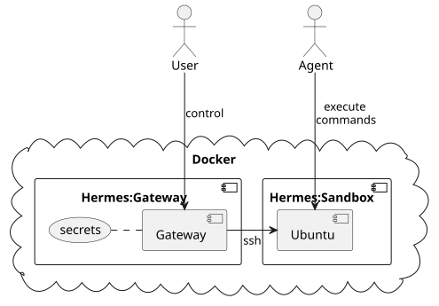
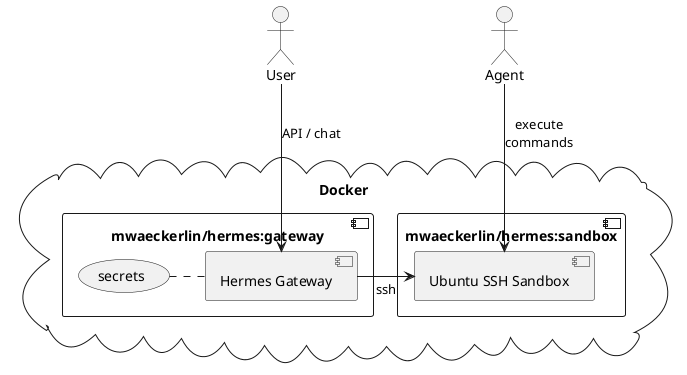
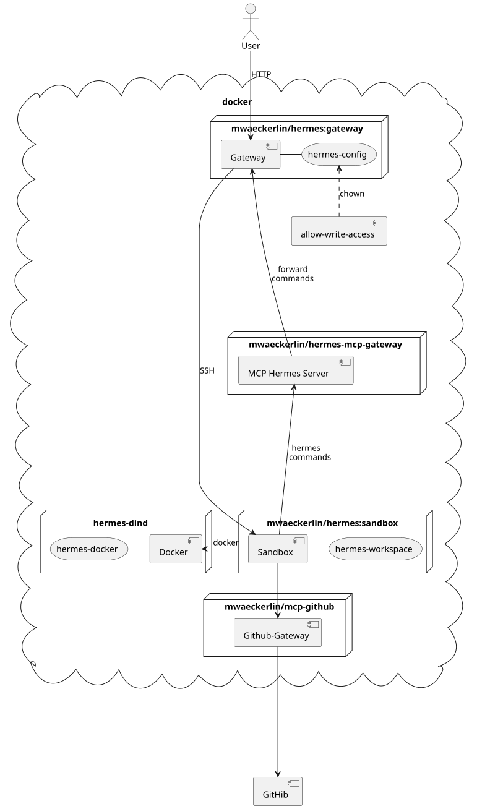
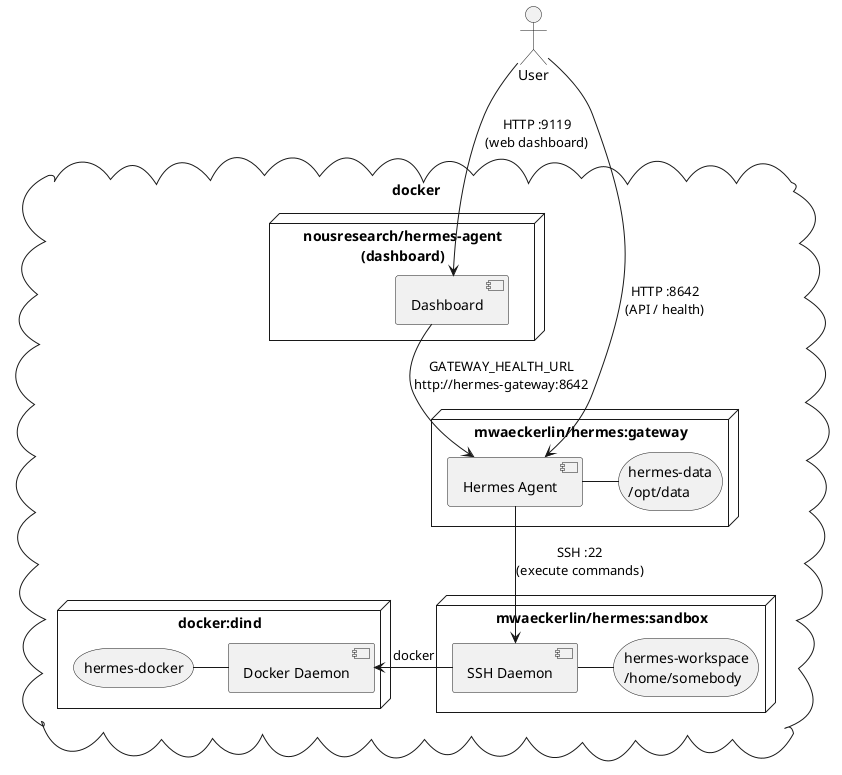

# Simple Secure Hermes in SSH Sandbox

Combine Hermes with security and ease of use! Run a fully sandboxed
[NousResearch Hermes agent](https://github.com/NousResearch/hermes-agent)
out of the box — locally or in a cloud.

**It has never been so easy to run a *secure* sandboxed Hermes!**:
1. get an API key (e.g. [OpenRouter](https://openrouter.ai/keys), [Anthropic](https://console.anthropic.com/), or [OpenAI](https://platform.openai.com/api-keys))
2. write some [configuration variables in `.env`](#local-development-setup)
3. run `npm start`
4. open the dashboard: [`http://localhost:9119/`](http://localhost:9119/)

Port 8642 is the internal gateway API and health endpoint (`/healthz`) — it is **not** published to the host. The web dashboard runs as a separate service on port 9119 and is the only publicly exposed port.

Or connect a chat platform (Telegram, Discord, Slack) and skip the HTTP ports entirely.

**Target audience:** Security-aware **developer** with basic Docker know-how.



<details>
<summary>PlantUML source</summary>



</details>

## Security Model

The primary security mechanism is **strict isolation**: the AI runs in a dedicated
sandbox container that has no access to the gateway's secrets, host files, or
production data.

### Container Segregation

- **Isolated sandbox** — the gateway controls all secrets. The agent executes
  commands inside the sandbox via SSH. No API keys, no LLM tokens, and no gateway
  configuration are accessible from the sandbox.
- **Container hardening** — `no-new-privileges` and `pids_limit: 256` prevent
  privilege escalation and fork bombs.

### Network Isolation

- **Segregated networks** — each container pair communicates on its own internal
  Docker network. The gateway and sandbox share `gateway-sandbox`; the dashboard
  and gateway share `dashboard-gateway` (the dashboard has **no direct access to
  the sandbox**); the sandbox and the Docker-in-Docker daemon share `sandbox-dind`.
  No cross-network traffic between non-adjacent tiers.
- **Network encryption** (production) — encrypt overlay networks when deploying
  to Docker Swarm: set `networks.<name>.driver_opts.encrypted: "true"` on each
  network, or add a service mesh.
- **Minimal port exposure** — only port 9119 (dashboard) is published. The
  gateway port 8642 is internal only, reachable solely via the `dashboard-gateway`
  network. If you use a chat platform such as Telegram you can close port 9119
  as well. *Do not expose port 9119 to the Internet without a TLS reverse proxy
  and authentication.*

### Secrets

- **Docker Secrets** (production) — use `docker secret` instead of environment
  variables. The gateway entrypoint reads every file in `/run/secrets/`, uppercases
  the filename, and exports it as an environment variable. Example:
  `/run/secrets/hermes_sandbox_ssh_private_key` → `HERMES_SANDBOX_SSH_PRIVATE_KEY`.

### SSH Trust Assumptions

The gateway connects to the sandbox over SSH using `StrictHostKeyChecking=no`.
This is intentional and acceptable because:

- Both containers share an internal Docker network (`gateway-sandbox`) that is
  not reachable from outside Docker.
- The security boundary is Docker network isolation, not SSH host key
  verification. Trusting Docker's internal networking is consistent with the
  overall threat model.
- For multi-host deployments (Docker Swarm), enable overlay network encryption
  (see [Network Isolation](#network-isolation) above) to protect traffic in transit.

Do **not** rely on SSH host key verification to protect against a compromised
Docker host — that is outside the scope of this design.

### Docker-in-Docker

The `hermes-dind` service provides an isolated Docker daemon for the sandbox. Gives the agent full root inside
the DinD container. The host Docker daemon is completely separate.

## Full Architecture



<details>
<summary>PlantUML source</summary>



</details>

## Local Development Setup

For local testing with `docker compose` and a `.env` file.

### 1. Generate SSH Keypair and `.env`

```bash
ssh-keygen -t ed25519 -f hermes-key -N "" -C "hermes-sandbox"
cat > .env <<EOF
HERMES_SANDBOX_SSH_PUBLIC_KEY=$(cat hermes-key.pub)
HERMES_SANDBOX_SSH_PRIVATE_KEY=$(sed -z 's/\n/\\n/g' hermes-key)
OPENROUTER_API_KEY=sk-or-...[YOUR-OPENROUTER-KEY]
EOF
rm hermes-key hermes-key.pub
```

You can also use a direct provider key:

```bash
# Anthropic
ANTHROPIC_API_KEY=sk-ant-...

# OpenAI
OPENAI_API_KEY=sk-...

# Google Gemini
GOOGLE_API_KEY=AIza...
```

The rendered configuration auto-selects the default model from whichever key is set
(priority: OpenAI → OpenRouter → Anthropic → Google → LiteLLM). Override with
`HERMES_DEFAULT_MODEL`.

### 2. Start

**In foreground (see logs in real-time):**
```bash
npm start
```

**In background (daemon mode):**
```bash
npm run start:daemon
```

Dashboard (web UI): `http://localhost:9119/`

The gateway API/health endpoint (`http://hermes-gateway:8642/healthz`) is
internal only — accessible within Docker but not published to the host.

**Local / trusted-network use only.** Do not expose the dashboard port to the
Internet without a TLS reverse proxy and authentication.

## Full Configuration Guide

### Automatic Secret Mapping

The gateway entrypoint reads every file under `/run/secrets/` and exports it as
an environment variable. Filename is uppercased, dashes replaced by underscores:

| Docker secret name | Environment variable |
|---|---|
| `hermes_sandbox_ssh_private_key` | `HERMES_SANDBOX_SSH_PRIVATE_KEY` |
| `openrouter_api_key` | `OPENROUTER_API_KEY` |
| `telegram_bot_token` | `TELEGRAM_BOT_TOKEN` |
| … | … |

Any Docker Secret is automatically available — no explicit mapping required.

### Core Variables

| Variable | Required | Description |
|---|---|---|
| `HERMES_SANDBOX_SSH_PUBLIC_KEY` | **yes** | Ed25519 public key for sandbox SSH access |
| `HERMES_SANDBOX_SSH_PRIVATE_KEY` | **yes** | Private key (`\n`-encoded), gateway → sandbox |

### LLM Providers

All optional — configure one or more. If none is set the gateway exits with an error on startup.

| Variable | Description |
|---|---|
| `OPENROUTER_API_KEY` | OpenRouter — access to 300+ models via one key. Auto-selects **`openai/gpt-5.5`**. See note below. |
| `ANTHROPIC_API_KEY` | Direct Anthropic (Claude) |
| `OPENAI_API_KEY` | Direct OpenAI. Auto-selects **`gpt-5.5`**. Also used for Whisper/TTS if `VOICE_TOOLS_OPENAI_KEY` is unset |
| `GOOGLE_API_KEY` / `GEMINI_API_KEY` | Google Gemini |
| `LITELLM_BASE_URL` | LiteLLM proxy URL (OpenAI-compatible, e.g. `http://litellm:4000`) |
| `LITELLM_API_KEY` | API key for the LiteLLM proxy (optional) |
| `LITELLM_DEFAULT_MODEL` | Default model served by LiteLLM (default: `gpt-4o`) |
| `HERMES_DEFAULT_MODEL` | Override auto-selected default (e.g. `anthropic/claude-opus-4.6`) |

> **OpenRouter — model ID naming**
>
> Hermes routes OpenRouter requests by calling `https://openrouter.ai/api/v1`
> directly. The `model` field in the request must be the **bare OpenRouter model
> slug** — do **not** include an `openrouter/` prefix. OpenRouter rejects IDs
> that include the routing prefix:
>
> ```
> HTTP 400: openrouter/openai/gpt-5.5 is not a valid model ID
> ```
>
> The rendered configuration auto-selects `openai/gpt-5.5` when
> `OPENROUTER_API_KEY` is set. To use a different model, override with
> `HERMES_DEFAULT_MODEL=<openrouter-model-slug>` (e.g.
> `anthropic/claude-3-opus`). Check <https://openrouter.ai/models> for the
> exact model slugs.

> **OpenAI — model ID**
>
> When `OPENAI_API_KEY` is set, Hermes auto-selects **`gpt-5.5`** as the default
> model. The OpenAI API key remains the token; `gpt-5.5` is the model ID sent to
> the OpenAI API.
>
> Override with `HERMES_DEFAULT_MODEL=<openai-model-id>` if the OpenAI account
> should use a different model.

### Messaging Channels

Channels are enabled by setting the corresponding token. No explicit `enabled: true` needed.

| Variable | Description |
|---|---|
| `TELEGRAM_BOT_TOKEN` | Telegram bot token (from @BotFather) |
| `TELEGRAM_ALLOWED_USERS` | Comma-separated Telegram user IDs (default: open) |
| `TELEGRAM_HOME_CHANNEL` | Default chat for cron job notifications |
| `TELEGRAM_WEBHOOK_URL` | Switch to webhook mode (cloud deployments) |
| `DISCORD_BOT_TOKEN` | Discord bot token |
| `SLACK_BOT_TOKEN` | Slack bot OAuth token (`xoxb-…`) |
| `SLACK_APP_TOKEN` | Slack app-level token for Socket Mode (`xapp-…`) |
| `SLACK_ALLOWED_USERS` | Comma-separated Slack user IDs |
| `WHATSAPP_ENABLED` | `true` to enable. Run `hermes whatsapp` to pair. |
| `WHATSAPP_ALLOWED_USERS` | Comma-separated phone numbers |
| `GATEWAY_ALLOW_ALL_USERS` | `true` (Hermes default) = anyone in your chat groups can use the bot; set to `false` and configure per-platform `*_ALLOWED_USERS` for production. |

For Telegram bots created with @BotFather: if the bot should also work in group
chats, run `/setprivacy` in BotFather and set the bot to `Disable`. Otherwise
Telegram privacy mode will prevent the bot from seeing normal group messages.

When a new user contacts the bot for the first time, they receive a random pairing
code and are asked to pass it to the bot owner for approval. To approve (or revoke)
users, open the **Dashboard → Pairing** tab at `http://localhost:9119/pairing`.
The Pairing tab lists all pending codes with one-click **Approve** buttons, and
shows all approved users with **Revoke** buttons. No CLI required.

### Command Approvals

This deployment executes agent commands inside the isolated SSH sandbox. The
sandbox has no gateway secrets, no LLM tokens, and no direct host filesystem
access, so command approval prompts are disabled by default:

```yaml
approvals:
  mode: off
```

Use `HERMES_APPROVALS_MODE=manual` or `HERMES_APPROVALS_MODE=smart` if you run a
different deployment where terminal commands can affect trusted systems.

### Tool API Keys

| Variable | Description |
|---|---|
| `VOICE_TOOLS_OPENAI_KEY` | Whisper STT + OpenAI TTS. Defaults to `OPENAI_API_KEY` if unset. |
| `GROQ_API_KEY` | Groq free-tier Whisper STT |
| `EXA_API_KEY` | Exa web search |
| `FIRECRAWL_API_KEY` | Firecrawl web scrape / crawl |
| `PARALLEL_API_KEY` | Parallel web extract |
| `TAVILY_API_KEY` | Tavily web search / extract |
| `FAL_KEY` | fal.ai image generation |
| `BROWSERBASE_API_KEY` | Browserbase cloud browser automation |
| `BROWSERBASE_PROJECT_ID` | Browserbase project ID |
| `ELEVENLABS_API_KEY` | ElevenLabs premium TTS |
| `GITHUB_TOKEN` | GitHub token (Skills Hub + higher rate limits) |

### Text-to-Speech Configuration

Hermes can reply to voice messages with a synthesized voice. By default it uses
**Microsoft TTS** — free, no API key required. When `ELEVENLABS_API_KEY` is set,
ElevenLabs is selected automatically for higher-quality audio.

**Automatic language matching** (`model_overrides.enabled: true`, the default)
instructs the TTS provider to select a voice that matches the detected language of
the text. German text gets a German voice, French text gets a French voice, etc.

| Variable | Description |
|---|---|
| `HERMES_TTS_ENABLED` | `false` to disable voice replies to voice messages (default: `true`) |
| `HERMES_TTS_PROVIDER` | TTS provider when no API key auto-selects one (default: `microsoft`) |
| `HERMES_TTS_MODEL_OVERRIDES_ENABLED` | `false` to disable automatic language-matched voice selection (default: `true`) |
| `HERMES_TTS_YAML` | Override the entire `tts:` section with a JSON/YAML string |

**Provider auto-selection priority:**

1. If `ELEVENLABS_API_KEY` is set → `elevenlabs`
2. Otherwise → `microsoft` (free, no key needed)

Override with `HERMES_TTS_PROVIDER` or use `HERMES_TTS_YAML` for full
customization of the TTS section.

### Vision Configuration

Hermes uses a dedicated vision model to understand images sent in chat. Vision is
configured under `auxiliary.vision` (not a top-level key). The provider and model
are **auto-selected** based on whichever LLM API key is active:

| Active key | Default vision provider & model |
|---|---|
| `OPENROUTER_API_KEY` | `openrouter` / `anthropic/claude-sonnet-4` |
| `ANTHROPIC_API_KEY` | `anthropic` / `claude-sonnet-4-5` |
| `GOOGLE_API_KEY` / `GEMINI_API_KEY` | `gemini` / `gemini-2.0-flash` |
| `OPENAI_API_KEY` | `openai` / `gpt-4o` |
| `LITELLM_BASE_URL` | LiteLLM proxy / `LITELLM_DEFAULT_MODEL` (or `gpt-4o`) |

| Variable | Description |
|---|---|
| `HERMES_VISION_PROVIDER` | Override the auto-selected vision provider (`auxiliary.vision.provider`) |
| `HERMES_VISION_MODEL` | Override the auto-selected vision model (`auxiliary.vision.model`) |
| `HERMES_AUXILIARY_YAML` | Override the entire `auxiliary:` section (compression + vision + web_extract) |

### Web Search Backend

Web tools auto-select a backend based on available API keys (priority: Firecrawl → Parallel → Tavily → Exa).

| Variable | Description |
|---|---|
| `HERMES_WEB_BACKEND` | Force a specific backend: `firecrawl` \| `parallel` \| `tavily` \| `exa` |
| `HERMES_WEB_YAML` | Override the entire `web:` section with a JSON/YAML string |
| `FIRECRAWL_API_KEY` | Firecrawl API key (search + scrape + crawl) |
| `PARALLEL_API_KEY` | Parallel API key (search + extract) |
| `TAVILY_API_KEY` | Tavily API key (search + extract + crawl) |
| `EXA_API_KEY` | Exa API key (search + extract) |

### Browser Automation

| Variable | Description |
|---|---|
| `HERMES_BROWSER_INACTIVITY_TIMEOUT` | Seconds before an idle browser session is auto-closed (default: `120`) |
| `HERMES_BROWSER_COMMAND_TIMEOUT` | Timeout in seconds for browser commands (default: Hermes built-in) |
| `HERMES_BROWSER_CDP_URL` | Attach to an existing Chrome via CDP URL instead of launching a headless browser |
| `HERMES_BROWSER_YAML` | Override the entire `browser:` section with a JSON/YAML string |

### Privacy — PII Redaction

When `HERMES_PRIVACY_REDACT_PII=true`, the gateway hashes phone numbers, user IDs and
chat IDs in the system prompt before sending context to the LLM.

| Variable | Description |
|---|---|
| `HERMES_PRIVACY_REDACT_PII` | `true` to enable PII redaction (default: `false`) |
| `HERMES_PRIVACY_YAML` | Override the entire `privacy:` section with a JSON/YAML string |

### Human Delay

Simulate human-like response pacing in messaging platforms.

| Variable | Description |
|---|---|
| `HERMES_HUMAN_DELAY_MODE` | `off` (default) \| `natural` \| `custom` |
| `HERMES_HUMAN_DELAY_MIN_MS` | Minimum delay in ms (custom mode, default: `800`) |
| `HERMES_HUMAN_DELAY_MAX_MS` | Maximum delay in ms (custom mode, default: `2500`) |
| `HERMES_HUMAN_DELAY_YAML` | Override the entire `human_delay:` section |

### Prompt Caching

Controls the Anthropic prompt cache TTL. Only affects Claude models via the Anthropic
API or OpenRouter.

| Variable | Description |
|---|---|
| `HERMES_PROMPT_CACHING_TTL` | Cache TTL: `5m` (default) or `1h` for long sessions with pauses |
| `HERMES_PROMPT_CACHING_YAML` | Override the entire `prompt_caching:` section |

### OpenRouter Provider Routing

Controls how requests are routed across providers on OpenRouter.
Only active when `OPENROUTER_API_KEY` is set.

| Variable | Description |
|---|---|
| `HERMES_PROVIDER_ROUTING_SORT` | Sort strategy: `price` (default) \| `throughput` \| `latency` |
| `HERMES_PROVIDER_ROUTING_YAML` | Full `provider_routing:` override (supports `sort`, `only`, `ignore`, `order`, etc.) |

### Miscellaneous Settings

| Variable | config.yaml key | Description |
|---|---|---|
| `HERMES_UNAUTHORIZED_DM_BEHAVIOR` | `unauthorized_dm_behavior` | `pair` (default — send pairing code) \| `ignore` |
| `HERMES_TIMEZONE` | `timezone` | IANA timezone string (e.g. `Europe/Berlin`). Default: server-local time |
| `HERMES_FILE_READ_MAX_CHARS` | `file_read_max_chars` | Max chars per `read_file` call. Hermes default: 100 000 |

### config.yaml — Section-Level Overrides

The gateway renders `files/config.yaml.j2` (Jinja2 template) into
`/opt/data/config.yaml` on startup. Each top-level YAML section can be
completely replaced by setting `HERMES_<SECTION>_YAML` to a JSON string
(JSON is valid YAML):

| Variable | config.yaml section |
|---|---|
| `HERMES_MODEL_YAML` | `model:` |
| `HERMES_TERMINAL_YAML` | `terminal:` |
| `HERMES_COMPRESSION_YAML` | `compression:` |
| `HERMES_MEMORY_YAML` | `memory:` |
| `HERMES_SESSION_RESET_YAML` | `session_reset:` |
| `HERMES_STREAMING_YAML` | `streaming:` |
| `HERMES_SKILLS_YAML` | `skills:` |
| `HERMES_AGENT_YAML` | `agent:` |
| `HERMES_PLATFORM_TOOLSETS_YAML` | `platform_toolsets:` |
| `HERMES_STT_YAML` | `stt:` |
| `HERMES_TTS_YAML` | `tts:` |
| `HERMES_AUXILIARY_YAML` | `auxiliary:` (compression + vision + web_extract) |
| `HERMES_TOOL_OUTPUT_YAML` | `tool_output:` |
| `HERMES_WEB_YAML` | `web:` |
| `HERMES_BROWSER_YAML` | `browser:` |
| `HERMES_PRIVACY_YAML` | `privacy:` |
| `HERMES_VOICE_YAML` | `voice:` |
| `HERMES_HUMAN_DELAY_YAML` | `human_delay:` |
| `HERMES_PROMPT_CACHING_YAML` | `prompt_caching:` |
| `HERMES_PROVIDER_ROUTING_YAML` | `provider_routing:` |
| `HERMES_CODE_EXECUTION_YAML` | `code_execution:` |
| `HERMES_DELEGATION_YAML` | `delegation:` |
| `HERMES_MCP_SERVERS_YAML` | `mcp_servers:` |
| `HERMES_DISPLAY_YAML` | `display:` |

Example — add an MCP server:

```bash
HERMES_MCP_SERVERS_YAML='{"time":{"command":"uvx","args":["mcp-server-time"]}}'
```

Example — restrict platform toolsets:

```bash
HERMES_PLATFORM_TOOLSETS_YAML='{"telegram":["web","terminal","file","skills","todo"]}'
```

### config.yaml — Individual Setting Overrides

| Variable | config.yaml path | Default |
|---|---|---|
| `HERMES_DEFAULT_MODEL` | `model.default` | auto-selected |
| `HERMES_MODEL_PROVIDER` | `model.provider` | `auto` |
| `HERMES_MODEL_BASE_URL` | `model.base_url` | — |
| `HERMES_MAX_TURNS` | `agent.max_turns` | `60` |
| `HERMES_GATEWAY_TIMEOUT` | `agent.gateway_timeout` | — (unlimited) |
| `HERMES_GATEWAY_TIMEOUT_WARNING` | `agent.gateway_timeout_warning` | — |
| `HERMES_GATEWAY_DRAIN_TIMEOUT` | `agent.restart_drain_timeout` | — |
| `HERMES_REASONING_EFFORT` | `agent.reasoning_effort` | `medium` |
| `HERMES_AGENT_VERBOSE` | `agent.verbose` | `false` |
| `HERMES_COMPRESSION_ENABLED` | `compression.enabled` | `true` |
| `HERMES_COMPRESSION_THRESHOLD` | `compression.threshold` | `0.50` |
| `HERMES_MEMORY_ENABLED` | `memory.memory_enabled` | `true` |
| `HERMES_USER_PROFILE_ENABLED` | `memory.user_profile_enabled` | `true` |
| `HERMES_SESSION_RESET_MODE` | `session_reset.mode` | `both` |
| `HERMES_SESSION_RESET_IDLE_MINUTES` | `session_reset.idle_minutes` | `1440` |
| `HERMES_GROUP_SESSIONS_PER_USER` | `group_sessions_per_user` | `true` |
| `HERMES_STREAMING_ENABLED` | `streaming.enabled` | `false` |
| `HERMES_SKILLS_NUDGE_INTERVAL` | `skills.creation_nudge_interval` | `15` |
| `HERMES_STT_ENABLED` | `stt.enabled` | `true` |
| `HERMES_TTS_ENABLED` | `tts.enabled` | `true` |
| `HERMES_TTS_PROVIDER` | `tts.provider` | `microsoft` (or `elevenlabs` if key set) |
| `HERMES_TTS_MODEL_OVERRIDES_ENABLED` | `tts.model_overrides.enabled` | `true` |
| `HERMES_VISION_PROVIDER` | `auxiliary.vision.provider` | auto-selected from active LLM provider |
| `HERMES_VISION_MODEL` | `auxiliary.vision.model` | auto-selected per provider (see Vision section) |
| `HERMES_WEB_EXTRACT_PROVIDER` | `auxiliary.web_extract.provider` | `auto` |
| `HERMES_WEB_EXTRACT_MODEL` | `auxiliary.web_extract.model` | — |
| `HERMES_FILE_READ_MAX_CHARS` | `file_read_max_chars` | — (Hermes default: 100 000) |
| `HERMES_TOOL_OUTPUT_MAX_BYTES` | `tool_output.max_bytes` | — (Hermes default: 50 000) |
| `HERMES_TOOL_OUTPUT_MAX_LINES` | `tool_output.max_lines` | — (Hermes default: 2000) |
| `HERMES_TOOL_OUTPUT_MAX_LINE_LENGTH` | `tool_output.max_line_length` | — (Hermes default: 2000) |
| `HERMES_WEB_BACKEND` | `web.backend` | auto-detected from API keys |
| `HERMES_BROWSER_INACTIVITY_TIMEOUT` | `browser.inactivity_timeout` | `120` |
| `HERMES_BROWSER_COMMAND_TIMEOUT` | `browser.command_timeout` | — |
| `HERMES_BROWSER_CDP_URL` | `browser.cdp_url` | — |
| `HERMES_PRIVACY_REDACT_PII` | `privacy.redact_pii` | `false` |
| `HERMES_VOICE_AUTO_TTS` | `voice.auto_tts` | `false` |
| `HERMES_VOICE_MAX_RECORDING_SECONDS` | `voice.max_recording_seconds` | `120` |
| `HERMES_HUMAN_DELAY_MODE` | `human_delay.mode` | — (`off`) |
| `HERMES_HUMAN_DELAY_MIN_MS` | `human_delay.min_ms` | `800` |
| `HERMES_HUMAN_DELAY_MAX_MS` | `human_delay.max_ms` | `2500` |
| `HERMES_PROMPT_CACHING_TTL` | `prompt_caching.cache_ttl` | — (`5m`) |
| `HERMES_PROVIDER_ROUTING_SORT` | `provider_routing.sort` | — (`price`) |
| `HERMES_UNAUTHORIZED_DM_BEHAVIOR` | `unauthorized_dm_behavior` | — (`pair`) |
| `HERMES_TIMEZONE` | `timezone` | — (server-local) |
| `HERMES_DISPLAY_TOOL_PROGRESS` | `display.tool_progress` | `all` |
| `HERMES_DISPLAY_COMPACT` | `display.compact` | `false` |
| `HERMES_DISPLAY_SKIN` | `display.skin` | `default` |

### Config Persistence

`config.yaml` is stored in the `hermes-data` Docker volume (`/opt/data`).
On startup it is rendered from the template and written to the volume by default.
This keeps template defaults such as disabled command approvals in sync with the
container image.

To preserve manual edits in the volume:

```bash
OVERWRITE_CONFIG=false npm start
```

To edit `config.yaml` directly (advanced):

```bash
docker compose exec hermes-gateway cat /opt/data/config.yaml
docker compose exec hermes-gateway vi /opt/data/config.yaml
```

## Docker-in-Docker

The `hermes-dind` service provides an isolated Docker daemon for the sandbox.
`DOCKER_HOST=tcp://hermes-dind:2375` is already configured in the sandbox
container. To disable DinD, comment out the `hermes-dind` service and remove
the `DOCKER_HOST` environment variable and the `depends_on` entry from the
sandbox service.

**Who needs this?** Developers and DevOps engineers who want Hermes to build,
run, and test containerized applications. For general use (writing, research,
scripting), DinD is not needed.

**Security warning:** The AI has full root access inside the DinD daemon. It can
destroy all images/containers or exhaust disk space on the `hermes-docker` volume.
DinD is isolated from the host Docker daemon, but within its own daemon the AI
has unrestricted access. Enable only if you accept that risk.

### DinD in Docker Swarm

Docker Swarm does not support `privileged: true` in stack deploy files.
Docker-in-Docker is therefore not supported in Swarm mode.

## Production Checklist

- [ ] All secrets via `docker secret`, not environment variables
- [ ] Encrypted overlay networks (uncomment `driver_opts: encrypted: "true"` in `docker-compose.yml`)
- [ ] Port 9119 (dashboard) behind TLS reverse proxy with authentication — or not exposed publicly (not needed when using only chat platforms)
- [ ] `GATEWAY_ALLOW_ALL_USERS=false` with explicit `TELEGRAM_ALLOWED_USERS`/`DISCORD_*` allowlists (Hermes default is `true` — open access)
- [ ] Firewall restricts access to the dashboard port
