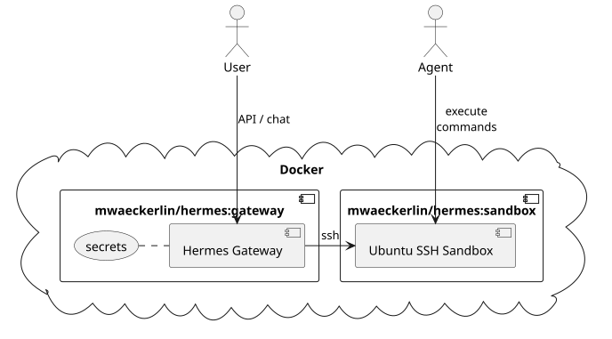
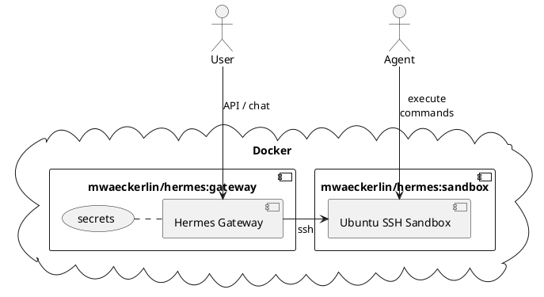
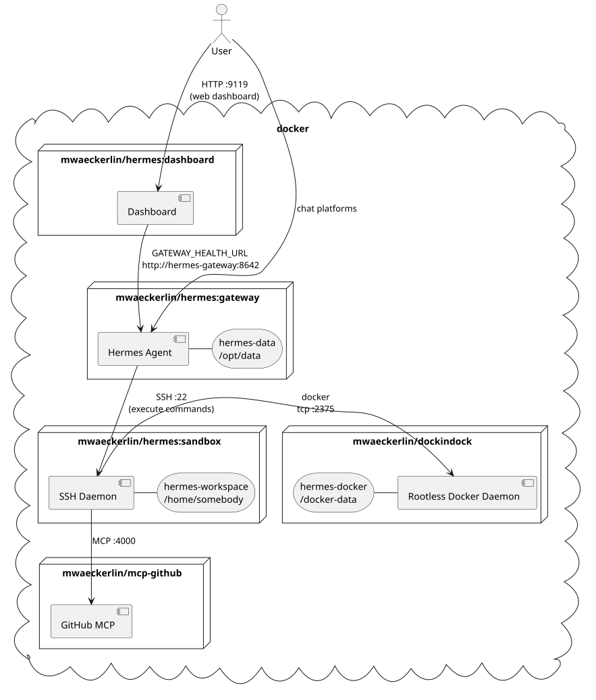
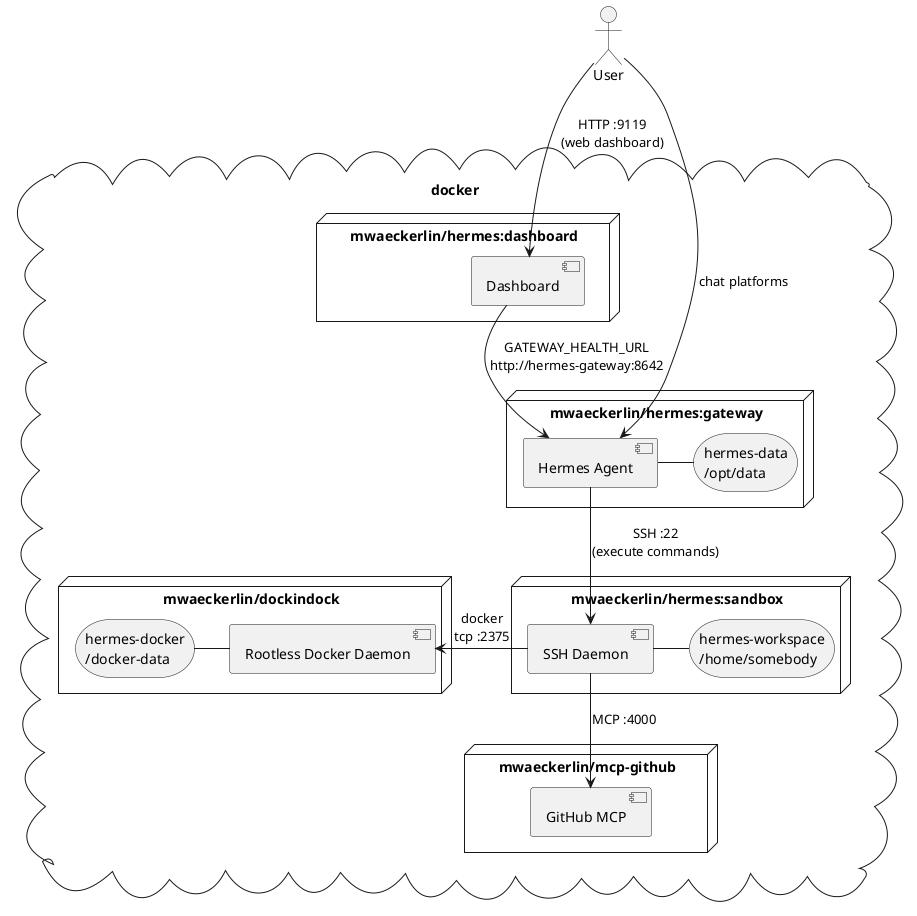

# Simple Secure Hermes in SSH Sandbox

The AI agent never gets a token, a key or a password. The gateway keeps every credential, the agent's commands and files run in a separate sandbox container that holds none, and the agent is instructed never to ask you for one. An end-to-end test proves it on every build: it puts a marker value into every secret the gateway knows, lets the real agent search the sandbox for them the way a hostile model would, and fails on the first marker it finds (see [Secrets and the Agent](#secrets-and-the-agent)).

Run a fully sandboxed [NousResearch Hermes agent](https://github.com/NousResearch/hermes-agent) out of the box — locally or in a cloud.

A sandboxed Hermes runs after these steps:

1. get an API key (e.g. [OpenRouter](https://openrouter.ai/keys), [Anthropic](https://console.anthropic.com/), or [OpenAI](https://platform.openai.com/api-keys))
2. write some [configuration variables in `.env`](#local-development-setup)
3. run `npm start`
4. open the dashboard: [`http://localhost:9119/`](http://localhost:9119/)

Port 8642 is the internal gateway API and health endpoint (`/healthz`) — it is **not** published to the host. The web dashboard runs as a separate service on port 9119 and is the only publicly exposed port.

Or connect a chat platform (Telegram, Discord, Slack) and skip the HTTP ports entirely.

The stack is written for security-aware developers with basic Docker know-how.

All features are listed in [FEATURES.md](FEATURES.md), all tests in [TESTS.md](TESTS.md). The sandbox builds on [mwaeckerlin/sandbox-base](https://github.com/mwaeckerlin/sandbox-base); docker-in-docker runs the rootless [mwaeckerlin/dockindock](https://github.com/mwaeckerlin/dockindock), which needs no host configuration.



<details>
<summary>PlantUML source</summary>


```plantuml
@startuml overview
cloud Docker {
  component "mwaeckerlin/hermes:gateway" {
    (secrets) . [Hermes Gateway]
  }
  component "mwaeckerlin/hermes:sandbox" {
    [Ubuntu SSH Sandbox]
  }
}
:User: --> [Hermes Gateway] : API / chat
[Hermes Gateway] -> [Ubuntu SSH Sandbox] : ssh
:Agent: --> [Ubuntu SSH Sandbox] : execute\ncommands
@enduml
```

</details>

## Local TODO Dashboard Plugin

The dashboard image includes a small local TODO plugin for agent task tracking. It stores tasks in the Hermes data volume, not on a public server.

A task moves through `open`, `in_progress`, `done`, `accepted` and `cancelled`. Each transition belongs to one side:

- **the human operator** (dashboard **TODO** tab) adds tasks, cancels a task in any state, accepts a `done` task or rejects it back to `open` with a comment, and deletes a task once it is `accepted` or `cancelled`
- **the agent** (plugin API `POST /api/plugins/todo/claim-next` and `POST /api/plugins/todo/done/<id>`) claims the next open task and marks it `done`; the dashboard shows no button for these two transitions
- both sides append short progress notes

The plugin persists JSON at:

```text
$HERMES_HOME/todo-plugin/todos.json
```

In this compose setup, dashboard and gateway both mount the `hermes-data` volume at `/opt/data`, so TODO data survives container rebuilds and is visible to the agent runtime via the shared Hermes data volume. The SSH sandbox remains isolated and does not mount this volume directly.

Override the path if needed:

```yaml
environment:
  HERMES_TODO_FILE: /opt/data/todo-plugin/todos.json
```

## Security Model

The primary security mechanism is **strict isolation**: the AI runs in a dedicated sandbox container that has no access to the gateway's secrets, host files, or production data.

### Container Segregation

- **Isolated sandbox** — the gateway controls all secrets. The agent executes commands inside the sandbox via SSH. No API keys, no LLM tokens, and no gateway configuration are accessible from the sandbox.
- **Container hardening** — `no-new-privileges` and `pids_limit: 256` prevent privilege escalation and fork bombs.

### Network Isolation

- **Segregated networks** — each container pair communicates on its own internal Docker network. The gateway and sandbox share `gateway-sandbox`; the dashboard and gateway share `dashboard-gateway` (the dashboard has **no direct access to the sandbox**); the sandbox and the Docker-in-Docker daemon share `sandbox-dind`; the sandbox and the GitHub MCP service share `sandbox-mcp-github` (the `GITHUB_TOKEN` stays in the MCP service and never reaches the sandbox). No cross-network traffic between non-adjacent tiers.
- **Network encryption** (production) — encrypt overlay networks when deploying to Docker Swarm: set `networks.<name>.driver_opts.encrypted: "true"` on each network, or add a service mesh.
- **Minimal port exposure** — only port 9119 (dashboard) is published. The gateway port 8642 is internal only, reachable solely via the `dashboard-gateway` network. If you use a chat platform such as Telegram you can close port 9119 as well. *Do not expose port 9119 to the Internet without a TLS reverse proxy and authentication.*

### Secrets and the Agent

The model decides what the agent does, so the agent is treated as untrusted: nothing it can run or read holds a secret. The gateway, which holds them, keeps them away from the agent on every path hermes offers:

- **Commands and files** — the agent's terminal and file tools run in the sandbox over SSH; local code execution in the gateway is switched off.
- **Variables** — hermes can hand gateway variables to the sandbox (a skill's `required_environment_variables`, `terminal.env_passthrough`). It sends them with SSH `SendEnv`, and the sandbox's `sshd` accepts no such variable. The entrypoint also drops `HERMES_SANDBOX_SSH_PRIVATE_KEY` from the environment once it has written the key file.
- **Files** — hermes can copy files from `$HERMES_HOME` into the sandbox (a skill's `required_credential_files`, `terminal.credential_files`). The SSH private key therefore lives in `/run/hermes-ssh`, outside `$HERMES_HOME`; `.env` and `auth.json` are on hermes' own deny-list.
- **Configuration** — the gateway refuses to start when `terminal.env_passthrough` or `terminal.credential_files` is set, or when an MCP server would run inside the gateway (`command`); MCP servers run in containers of their own and are reached by `url`.
- **Chat** — hermes asks for a skill's missing credential only on interactive surfaces, which the gateway never is. A standing instruction (`HERMES_ENVIRONMENT_HINT`) tells the agent never to ask for a password, token, API key or private key, and, when you offer or send one, to warn you first that it becomes part of the conversation, which goes to the model provider and into the history.
- **Dashboard** — the sandbox shares no network with the dashboard, so the agent cannot reach its key and configuration pages.

`npm run test:isolation` proves all of this against the real images (see [Development](#development)).

Do not give the agent a secret: whatever you type into the chat is sent to the model provider and stored in the conversation history. If you have sent one, revoke it.

### Remaining Risks

- **The gateway holds the secrets.** Every channel token and API key the gateway needs sits in its process. hermes' own code uses them; a flaw in hermes, in a plugin or in a dependency of the gateway image can expose them without the agent's help.
- **The rule against asking for secrets is an instruction.** A model can disregard it and ask anyway; nothing technical stops a question in the chat. The isolation stops a secret from reaching the agent unless you send it yourself.
- **The dashboard can read and change keys and configuration.** Whoever logs in on port 9119 can write `.env`, change `config.yaml` while the gateway runs, and reveal keys stored in `.env`. It requires a login (`HERMES_DASHBOARD_BASIC_AUTH_*`) and speaks plain HTTP: publish it only behind a TLS reverse proxy, or not at all.
- **A configuration changed at runtime is checked at the next start only.** The isolation check runs in the entrypoint; a `config.yaml` edited through the dashboard takes effect before it. The sandbox's `sshd` still drops every variable, and `$HERMES_HOME` holds no key file to copy.
- **The SSH key of the sandbox is in the gateway.** Whoever controls the gateway controls the sandbox; the key never reaches the sandbox or the agent.
- **OpenCode without a password trusts its network.** The sandbox reaches the OpenCode server without a password, so every container on that network can hand OpenCode tasks, and OpenCode acts with its own model key. Only the agent sandboxes and OpenCode join that network (see [Development with OpenCode](#development-with-opencode)).

### Docker Secrets

- **Docker Secrets** (production) — use `docker secret` instead of environment variables. The gateway entrypoint reads every file in `/run/secrets/`, uppercases the filename, and exports it as an environment variable. Example: `/run/secrets/hermes_sandbox_ssh_private_key` → `HERMES_SANDBOX_SSH_PRIVATE_KEY`.

### SSH Trust Assumptions

The gateway connects to the sandbox over SSH using `StrictHostKeyChecking=no`. This is intentional and acceptable because:

- Both containers share an internal Docker network (`gateway-sandbox`) that is not reachable from outside Docker.
- The security boundary is Docker network isolation, not SSH host key verification. Trusting Docker's internal networking is consistent with the overall threat model.
- For multi-host deployments (Docker Swarm), enable overlay network encryption (see [Network Isolation](#network-isolation) above) to protect traffic in transit.

Do **not** rely on SSH host key verification to protect against a compromised Docker host — that is outside the scope of this design.

### Docker-in-Docker

The `hermes-dind` service provides an isolated Docker daemon for the sandbox. It is the rootless [mwaeckerlin/dockindock](https://github.com/mwaeckerlin/dockindock): the agent controls that daemon fully, and a compromise of the daemon yields its unprivileged user, never root. The host Docker daemon is completely separate.

## Full Architecture



<details>
<summary>PlantUML source</summary>


```plantuml
@startuml architecture
actor User as user

cloud docker {

  node "mwaeckerlin/hermes:gateway" as gw {
    [Hermes Agent] as ctrl
    storage "hermes-data\n/opt/data" as cfg
    ctrl - cfg
  }

  node "mwaeckerlin/hermes:dashboard" as dash {
    [Dashboard] as ui
  }

  node "mwaeckerlin/hermes:sandbox" as sb {
    [SSH Daemon] as sshd
    storage "hermes-workspace\n/home/somebody" as ws
    sshd -right- ws
  }

  node "mwaeckerlin/dockindock" as dind {
    [Rootless Docker Daemon] as dd
    storage "hermes-docker\n/docker-data" as dv
    dd -left- dv
  }

  node "mwaeckerlin/mcp-github" as mcp {
    [GitHub MCP] as gh
  }
}

user --> ui : "HTTP :9119\n(web dashboard)"
user --> ctrl : "chat platforms"
ui --> ctrl : "GATEWAY_HEALTH_URL\nhttp://hermes-gateway:8642"
ctrl --> sshd : "SSH :22\n(execute commands)"
sshd -left-> dd : "docker\ntcp :2375"
sshd --> gh : "MCP :4000"
@enduml
```

</details>

## Local Development Setup

For local testing with `docker compose` and a `.env` file.

### 1. Generate SSH Keypair and `.env`

```bash
ssh-keygen -t ed25519 -f hermes-key -N "" -C "hermes-sandbox"
cat > .env <<EOF
HERMES_SANDBOX_SSH_PUBLIC_KEY=$(cat hermes-key.pub)
HERMES_SANDBOX_SSH_PRIVATE_KEY=$(sed -z 's/\n/\\n/g' hermes-key)
OPENROUTER_API_KEY=sk-or-...[YOUR-OPENROUTER-KEY]
EOF
rm hermes-key hermes-key.pub
```

You can also use a direct provider key:

```bash
# Anthropic
ANTHROPIC_API_KEY=sk-ant-...

# OpenAI
OPENAI_API_KEY=sk-...

# Google Gemini
GOOGLE_API_KEY=AIza...
```

The rendered configuration auto-selects the default model from whichever key is set (priority: OpenAI → OpenRouter → Anthropic → Google → LiteLLM). Override with `HERMES_DEFAULT_MODEL`.

The dashboard needs a login; hermes refuses to serve it on the network without one. Add a user name and a password to `.env`:

```bash
HERMES_DASHBOARD_BASIC_AUTH_USERNAME=admin
HERMES_DASHBOARD_BASIC_AUTH_PASSWORD=[YOUR-DASHBOARD-PASSWORD]
```

For production, give `HERMES_DASHBOARD_BASIC_AUTH_PASSWORD_HASH` instead of the password, made with `docker compose run --rm --entrypoint /opt/hermes/.venv/bin/python3 hermes-dashboard -c "from plugins.dashboard_auth.basic import hash_password; print(hash_password('…'))"`, and a fixed `HERMES_DASHBOARD_BASIC_AUTH_SECRET` so sessions survive a restart.

### 2. Start

`npm start` runs the stack in the foreground and shows the logs as they arrive:

```bash
$ npm start
```

`npm run start:daemon` runs it in the background:

```bash
$ npm run start:daemon
```

Dashboard (web UI): `http://localhost:9119/`

The gateway API/health endpoint (`http://hermes-gateway:8642/healthz`) is internal only — accessible within Docker but not published to the host.

This setup is for local or trusted-network use only. Do not expose the dashboard port to the Internet without a TLS reverse proxy and authentication.

## Full Configuration Guide

### Automatic Secret Mapping

The gateway entrypoint reads every file under `/run/secrets/` and exports it as an environment variable. Filename is uppercased, dashes replaced by underscores:

| Docker secret name | Environment variable |
|---|---|
| `hermes_sandbox_ssh_private_key` | `HERMES_SANDBOX_SSH_PRIVATE_KEY` |
| `openrouter_api_key` | `OPENROUTER_API_KEY` |
| `telegram_bot_token` | `TELEGRAM_BOT_TOKEN` |
| … | … |

Any Docker Secret is automatically available — no explicit mapping required.

### Core Variables

| Variable | Required | Description |
|---|---|---|
| `HERMES_SANDBOX_SSH_PUBLIC_KEY` | **yes** | Ed25519 public key for sandbox SSH access |
| `HERMES_SANDBOX_SSH_PRIVATE_KEY` | **yes** | Private key (`\n`-encoded), gateway → sandbox |

### MCP GitHub Routing (Sandbox)

| Variable | Required | Description |
|---|---|---|
| `MCP_GITHUB_URL` | no (compose default) | MCP GitHub endpoint used by sandboxed sessions. Default in this setup: `http://mcp-github:4000`. The sandbox entrypoint exports it to `/etc/environment`, so the non-root SSH user can read it. |

### Development with OpenCode

The agent hands every software development task to the central [OpenCode](https://opencode.ai) server of the cluster, [mwaeckerlin/opencode](https://github.com/mwaeckerlin/opencode), which works in its own workspace and is tuned for exactly that. The sandbox carries the OpenCode client, taken from the image `mwaeckerlin/opencode:sandbox` so it matches the server's release, and the command `opencode-delegate "<task>"`, which the skill `opencode-delegation` tells the agent to use: it sends the task to OpenCode's HTTP API, waits until OpenCode is done, and prints the answer into the conversation, with the session id for a follow-up (`--session <id>`). `opencode run --attach` reaches the server as well, but in OpenCode 1.18 it prints no answer without a terminal.

| Variable | Required | Description |
|---|---|---|
| `HERMES_OPENCODE_URL` | no | URL of the OpenCode server (port 4096), e.g. `http://opencode-sandbox:4096`; set on the sandbox service, whose entrypoint exports it to `/etc/environment`; empty: no delegation |
| `HERMES_OPENCODE_TIMEOUT` | no | Seconds `opencode-delegate` waits for OpenCode's answer before it gives up with a message (default `7200`); set on the sandbox service like the URL |

The sandbox reaches OpenCode directly, so it shares a network with the OpenCode server, and nothing else of the stack needs to. OpenCode's optional password (`OPENCODE_SERVER_PASSWORD_FILE` on the server) never belongs into the sandbox, because the agent could read it there. Without a password, whoever reaches port 4096 controls OpenCode, so the network between the sandboxes and OpenCode is joined by nothing else. Where that network is not closed, put a proxy in front of OpenCode that adds the password as HTTP basic auth (user `opencode`), and point `HERMES_OPENCODE_URL` at the proxy.

### LLM Providers

All optional — configure one or more. If none is set the gateway exits with an error on startup.

| Variable | Description |
|---|---|
| `OPENROUTER_API_KEY` | OpenRouter — access to 300+ models via one key. Auto-selects **`~moonshotai/kimi-latest`**. See note below. |
| `ANTHROPIC_API_KEY` | Direct Anthropic (Claude) |
| `OPENAI_API_KEY` | Direct OpenAI. Auto-selects **`gpt-4.6`**. Also used for Whisper/TTS if `VOICE_TOOLS_OPENAI_KEY` is unset |
| `GOOGLE_API_KEY` / `GEMINI_API_KEY` | Google Gemini |
| `LITELLM_BASE_URL` | LiteLLM proxy URL (OpenAI-compatible, e.g. `http://litellm:4000`) |
| `LITELLM_API_KEY` | API key for the LiteLLM proxy (optional) |
| `LITELLM_DEFAULT_MODEL` | Default model served by LiteLLM (default: `~moonshotai/kimi-latest`) |
| `HERMES_DEFAULT_MODEL` | Override auto-selected default (e.g. `anthropic/claude-opus-4.6`) |

`LITELLM_API_KEY` is optional; give a scoped LiteLLM key, ideally as the Docker secret `litellm_api_key`. The gateway sends it with every request, and it never reaches the agent (see [Secrets and the Agent](#secrets-and-the-agent)). Without it, hermes sends the fixed placeholder `Authorization: Bearer no-key-required`, for a LiteLLM that needs no key or a proxy in front of it that sets the header.

> **OpenRouter — model ID naming**
>
> Hermes routes OpenRouter requests by calling `https://openrouter.ai/api/v1`
> directly. The `model` field in the request must be the **bare OpenRouter model
> slug** — do **not** include an `openrouter/` prefix. OpenRouter rejects IDs
> that include the routing prefix:
>
> ```
> HTTP 400: openrouter/openai/gpt-5 is not a valid model ID
> ```
>
> The rendered configuration auto-selects `~moonshotai/kimi-latest` when
> `OPENROUTER_API_KEY` is set. To use a different model, override with
> `HERMES_DEFAULT_MODEL=<openrouter-model-slug>` (e.g.
> `anthropic/claude-3-opus`). Check <https://openrouter.ai/models> for the
> exact model slugs.

> **OpenAI — model ID**
>
> When `OPENAI_API_KEY` is set, Hermes auto-selects **`gpt-4.6`** as the default
> model. The OpenAI API key remains the token; `gpt-4.6` is the model ID sent to
> the OpenAI API.
>
> Override with `HERMES_DEFAULT_MODEL=<openai-model-id>` if the OpenAI account
> should use a different model.

### Hindsight Long-Term Memory

[Hindsight](https://github.com/vectorize-io/hindsight) is a self-hosted agent memory. The gateway image carries its hermes memory provider at the commit the hermes-agent plugin catalog pins. With `HERMES_MEMORY_PROVIDER=hindsight` the agent recalls from and retains into its own memory bank on every turn and gets the tools `hindsight_retain`, `hindsight_recall` and `hindsight_reflect`. A second bank, shared with other agents, joins as an MCP server.

| Variable | Default | Description |
|---|---|---|
| `HERMES_MEMORY_PROVIDER` | — | `hindsight` activates the provider |
| `HINDSIGHT_API_URL` | `http://localhost:8888` | Hindsight server, or the proxy in front of it |
| `HINDSIGHT_MODE` | `local_external` | `local_external` for a self-hosted server; `cloud` for Hindsight Cloud |
| `HINDSIGHT_BANK_ID` | `hermes` | The agent's own memory bank |
| `HINDSIGHT_MEMORY_MODE` | `hybrid` | `hybrid` (automatic recall and retain plus tools), `context` (automatic only) or `tools` (tools only) |
| `HINDSIGHT_BUDGET` | `mid` | Recall thoroughness: `low`, `mid`, `high` |
| `HINDSIGHT_RETAIN_TAGS` | — | Tags on every retained memory, comma-separated |
| `HINDSIGHT_RETAIN_SOURCE` | — | `metadata.source` on every retained memory |
| `HINDSIGHT_TIMEOUT` | `120` | Seconds per request |
| `HINDSIGHT_SHARED_MCP_URL` | — | MCP endpoint of the shared bank, `http://<server>:8888/mcp/<bank>/`; rendered into `mcp_servers` as `hindsight-shared`, beside the servers of `HERMES_MCP_SERVERS_YAML` |

The gateway entrypoint writes these settings to `$HERMES_HOME/hindsight/config.json` on every start. The file never holds a key. The Hindsight key (the server's `HINDSIGHT_API_TENANT_API_KEY`) is optional: give it to the gateway as `HINDSIGHT_API_KEY`, ideally as the Docker secret `hindsight_api_key`, or put a proxy in front of the server that adds `Authorization: Bearer <key>`. Either way it never reaches the agent.

### Messaging Channels

Channels are enabled by setting the corresponding token. No explicit `enabled: true` needed.

| Variable | Description |
|---|---|
| `TELEGRAM_BOT_TOKEN` | Telegram bot token (from @BotFather) |
| `TELEGRAM_ALLOWED_USERS` | Comma-separated Telegram user IDs (default: open) |
| `TELEGRAM_HOME_CHANNEL` | Default chat for cron job notifications |
| `TELEGRAM_WEBHOOK_URL` | Switch to webhook mode (cloud deployments) |
| `DISCORD_BOT_TOKEN` | Discord bot token |
| `SLACK_BOT_TOKEN` | Slack bot OAuth token (`xoxb-…`) |
| `SLACK_APP_TOKEN` | Slack app-level token for Socket Mode (`xapp-…`) |
| `SLACK_ALLOWED_USERS` | Comma-separated Slack user IDs |
| `WHATSAPP_ENABLED` | `true` to enable. Run `hermes whatsapp` to pair. |
| `WHATSAPP_ALLOWED_USERS` | Comma-separated phone numbers |
| `GATEWAY_ALLOW_ALL_USERS` | `true` (Hermes default) = anyone in your chat groups can use the bot; set to `false` and configure per-platform `*_ALLOWED_USERS` for production. |

For Telegram bots created with @BotFather: if the bot should also work in group chats, run `/setprivacy` in BotFather and set the bot to `Disable`. Otherwise Telegram privacy mode will prevent the bot from seeing normal group messages.

When a new user contacts the bot for the first time, they receive a random pairing code and are asked to pass it to the bot owner for approval. To approve (or revoke) users, open the **Dashboard → Pairing** tab at `http://localhost:9119/pairing`. The Pairing tab lists every pending request with platform, user and age and a one-click **Approve** button, and shows all approved users with **Revoke** buttons. Hermes never shows the code itself outside the chat, so the tab approves the request directly. No CLI required.

### Command Approvals

This deployment executes agent commands inside the isolated SSH sandbox. The sandbox has no gateway secrets, no LLM tokens, and no direct host filesystem access, so command approval prompts are disabled by default:

```yaml
approvals:
  mode: off
```

Use `HERMES_APPROVALS_MODE=manual` or `HERMES_APPROVALS_MODE=smart` if you run a different deployment where terminal commands can affect trusted systems.

### Tool API Keys

| Variable | Description |
|---|---|
| `VOICE_TOOLS_OPENAI_KEY` | Whisper STT + OpenAI TTS. Defaults to `OPENAI_API_KEY` if unset. |
| `GROQ_API_KEY` | Groq free-tier Whisper STT |
| `EXA_API_KEY` | Exa web search |
| `FIRECRAWL_API_KEY` | Firecrawl web scrape / crawl |
| `PARALLEL_API_KEY` | Parallel web extract |
| `TAVILY_API_KEY` | Tavily web search / extract |
| `FAL_KEY` | fal.ai image generation |
| `TOOL_GATEWAY_DOMAIN` | Custom/Nous Tool Gateway base domain (optional) |
| `TOOL_GATEWAY_SCHEME` | Tool Gateway scheme, `https` by default upstream |
| `TOOL_GATEWAY_USER_TOKEN` | Tool Gateway auth token for custom/self-hosted deployments |
| `FIRECRAWL_GATEWAY_URL` | Firecrawl gateway endpoint override |
| `NOUS_BASE_URL`, `NOUS_INFERENCE_BASE_URL`, `HERMES_PORTAL_BASE_URL` | Nous Portal/inference endpoint overrides |
| `BROWSERBASE_API_KEY` | Browserbase cloud browser automation |
| `BROWSERBASE_PROJECT_ID` | Browserbase project ID |
| `ELEVENLABS_API_KEY` | ElevenLabs premium TTS |
| `GITHUB_TOKEN` | GitHub token (Skills Hub + higher rate limits) |

### Image Generation Configuration

Direct fal.ai usage:

```env
FAL_KEY=...
HERMES_IMAGE_GEN_MODEL=fal-ai/gpt-image-2
HERMES_IMAGE_GEN_USE_GATEWAY=false
```

Nous Tool Gateway / custom gateway usage:

```env
HERMES_IMAGE_GEN_USE_GATEWAY=true
HERMES_IMAGE_GEN_MODEL=fal-ai/gpt-image-2
TOOL_GATEWAY_DOMAIN=nousresearch.com
TOOL_GATEWAY_SCHEME=https
TOOL_GATEWAY_USER_TOKEN=...
```

For complete control, override the rendered section directly:

```env
HERMES_IMAGE_GEN_YAML={"use_gateway":true,"model":"fal-ai/gpt-image-2"}
```

### Text-to-Speech Configuration

Hermes can reply to voice messages with a synthesized voice. By default it uses **Microsoft TTS** — free, no API key required. When `ELEVENLABS_API_KEY` is set, ElevenLabs is selected automatically for higher-quality audio.

Automatic language matching (`model_overrides.enabled: true`, the default) instructs the TTS provider to select a voice that matches the detected language of the text. German text gets a German voice, French text gets a French voice, etc.

| Variable | Description |
|---|---|
| `HERMES_TTS_ENABLED` | `false` to disable voice replies to voice messages (default: `true`) |
| `HERMES_TTS_PROVIDER` | TTS provider when no API key auto-selects one (default: `microsoft`) |
| `HERMES_TTS_MODEL_OVERRIDES_ENABLED` | `false` to disable automatic language-matched voice selection (default: `true`) |
| `HERMES_TTS_YAML` | Override the entire `tts:` section with a JSON/YAML string |

The provider is selected automatically in this order:

1. If `ELEVENLABS_API_KEY` is set → `elevenlabs`
2. Otherwise → `microsoft` (free, no key needed)

Override with `HERMES_TTS_PROVIDER` or use `HERMES_TTS_YAML` for full customization of the TTS section.

### Vision Configuration

Hermes uses a dedicated vision model to understand images sent in chat. Vision is configured under `auxiliary.vision` (not a top-level key). The provider and model are **auto-selected** based on whichever LLM API key is active:

| Active key | Default vision provider & model |
|---|---|
| `OPENROUTER_API_KEY` | `openrouter` / `anthropic/claude-sonnet-4` |
| `ANTHROPIC_API_KEY` | `anthropic` / `claude-sonnet-4-5` |
| `GOOGLE_API_KEY` / `GEMINI_API_KEY` | `gemini` / `gemini-2.0-flash` |
| `OPENAI_API_KEY` | `openai` / `gpt-4o` |
| `LITELLM_BASE_URL` | LiteLLM proxy / `LITELLM_DEFAULT_MODEL` (or `gpt-4o`) |

| Variable | Description |
|---|---|
| `HERMES_VISION_PROVIDER` | Override the auto-selected vision provider (`auxiliary.vision.provider`) |
| `HERMES_VISION_MODEL` | Override the auto-selected vision model (`auxiliary.vision.model`) |
| `HERMES_AUXILIARY_YAML` | Override the entire `auxiliary:` section (compression + vision + web_extract) |

### Web Search Backend

Web tools auto-select a backend based on available API keys (priority: Firecrawl → Parallel → Tavily → Exa).

| Variable | Description |
|---|---|
| `HERMES_WEB_BACKEND` | Force a specific backend: `firecrawl` \| `parallel` \| `tavily` \| `exa` |
| `HERMES_WEB_YAML` | Override the entire `web:` section with a JSON/YAML string |
| `FIRECRAWL_API_KEY` | Firecrawl API key (search + scrape + crawl) |
| `PARALLEL_API_KEY` | Parallel API key (search + extract) |
| `TAVILY_API_KEY` | Tavily API key (search + extract + crawl) |
| `EXA_API_KEY` | Exa API key (search + extract) |

### Browser Automation

| Variable | Description |
|---|---|
| `HERMES_BROWSER_INACTIVITY_TIMEOUT` | Seconds before an idle browser session is auto-closed (default: `120`) |
| `HERMES_BROWSER_COMMAND_TIMEOUT` | Timeout in seconds for browser commands (default: Hermes built-in) |
| `HERMES_BROWSER_CDP_URL` | Attach to an existing Chrome via CDP URL instead of launching a headless browser |
| `HERMES_BROWSER_YAML` | Override the entire `browser:` section with a JSON/YAML string |

### Privacy — PII Redaction

When `HERMES_PRIVACY_REDACT_PII=true`, the gateway hashes phone numbers, user IDs and chat IDs in the system prompt before sending context to the LLM.

| Variable | Description |
|---|---|
| `HERMES_PRIVACY_REDACT_PII` | `true` to enable PII redaction (default: `false`) |
| `HERMES_PRIVACY_YAML` | Override the entire `privacy:` section with a JSON/YAML string |

### Human Delay

Simulate human-like response pacing in messaging platforms.

| Variable | Description |
|---|---|
| `HERMES_HUMAN_DELAY_MODE` | `off` (default) \| `natural` \| `custom` |
| `HERMES_HUMAN_DELAY_MIN_MS` | Minimum delay in ms (custom mode, default: `800`) |
| `HERMES_HUMAN_DELAY_MAX_MS` | Maximum delay in ms (custom mode, default: `2500`) |
| `HERMES_HUMAN_DELAY_YAML` | Override the entire `human_delay:` section |

### Prompt Caching

Controls the Anthropic prompt cache TTL. Only affects Claude models via the Anthropic API or OpenRouter.

| Variable | Description |
|---|---|
| `HERMES_PROMPT_CACHING_TTL` | Cache TTL: `5m` (default) or `1h` for long sessions with pauses |
| `HERMES_PROMPT_CACHING_YAML` | Override the entire `prompt_caching:` section |

### OpenRouter Provider Routing

Controls how requests are routed across providers on OpenRouter. Only active when `OPENROUTER_API_KEY` is set.

| Variable | Description |
|---|---|
| `HERMES_PROVIDER_ROUTING_SORT` | Sort strategy: `price` (default) \| `throughput` \| `latency` |
| `HERMES_PROVIDER_ROUTING_YAML` | Full `provider_routing:` override (supports `sort`, `only`, `ignore`, `order`, etc.) |

### Miscellaneous Settings

| Variable | config.yaml key | Description |
|---|---|---|
| `HERMES_UNAUTHORIZED_DM_BEHAVIOR` | `unauthorized_dm_behavior` | `pair` (default — send pairing code) \| `ignore` |
| `HERMES_TIMEZONE` | `timezone` | IANA timezone string (e.g. `Europe/Berlin`). Default: server-local time |
| `HERMES_FILE_READ_MAX_CHARS` | `file_read_max_chars` | Max chars per `read_file` call. Hermes default: 100 000 |

### config.yaml — Section-Level Overrides

The gateway renders `files/config.yaml.j2` (Jinja2 template) into `/opt/data/config.yaml` on startup. Each top-level YAML section can be completely replaced by setting `HERMES_<SECTION>_YAML` to a JSON string (JSON is valid YAML):

| Variable | config.yaml section |
|---|---|
| `HERMES_MODEL_YAML` | `model:` |
| `HERMES_TERMINAL_YAML` | `terminal:` |
| `HERMES_COMPRESSION_YAML` | `compression:` |
| `HERMES_MEMORY_YAML` | `memory:` |
| `HERMES_SESSION_RESET_YAML` | `session_reset:` |
| `HERMES_STREAMING_YAML` | `streaming:` |
| `HERMES_SKILLS_YAML` | `skills:` |
| `HERMES_AGENT_YAML` | `agent:` |
| `HERMES_PLATFORM_TOOLSETS_YAML` | `platform_toolsets:` |
| `HERMES_STT_YAML` | `stt:` |
| `HERMES_TTS_YAML` | `tts:` |
| `HERMES_AUXILIARY_YAML` | `auxiliary:` (compression + vision + web_extract) |
| `HERMES_TOOL_OUTPUT_YAML` | `tool_output:` |
| `HERMES_WEB_YAML` | `web:` |
| `HERMES_BROWSER_YAML` | `browser:` |
| `HERMES_PRIVACY_YAML` | `privacy:` |
| `HERMES_VOICE_YAML` | `voice:` |
| `HERMES_HUMAN_DELAY_YAML` | `human_delay:` |
| `HERMES_PROMPT_CACHING_YAML` | `prompt_caching:` |
| `HERMES_PROVIDER_ROUTING_YAML` | `provider_routing:` |
| `HERMES_CODE_EXECUTION_YAML` | `code_execution:` |
| `HERMES_DELEGATION_YAML` | `delegation:` |
| `HERMES_MCP_SERVERS_YAML` | `mcp_servers:` |
| `HERMES_DISPLAY_YAML` | `display:` |

Example — add an MCP server:

The MCP server runs in a container of its own and is reached by its `url`:

```bash
HERMES_MCP_SERVERS_YAML='{"time":{"url":"http://mcp-time:8000/mcp"}}'
```

A server with `command` would run inside the gateway, with the gateway's secrets in its environment; the gateway refuses to start with one (see [Security Model](#security-model)).

Example — restrict platform toolsets:

```bash
HERMES_PLATFORM_TOOLSETS_YAML='{"telegram":["web","terminal","file","skills","todo"]}'
```

### config.yaml — Individual Setting Overrides

| Variable | config.yaml path | Default |
|---|---|---|
| `HERMES_DEFAULT_MODEL` | `model.default` | auto-selected |
| `HERMES_MODEL_PROVIDER` | `model.provider` | `auto` |
| `HERMES_MODEL_BASE_URL` | `model.base_url` | — |
| `HERMES_MAX_TURNS` | `agent.max_turns` | `60` |
| `HERMES_GATEWAY_TIMEOUT` | `agent.gateway_timeout` | — (unlimited) |
| `HERMES_GATEWAY_TIMEOUT_WARNING` | `agent.gateway_timeout_warning` | — |
| `HERMES_GATEWAY_DRAIN_TIMEOUT` | `agent.restart_drain_timeout` | — |
| `HERMES_REASONING_EFFORT` | `agent.reasoning_effort` | `medium` |
| `HERMES_AGENT_VERBOSE` | `agent.verbose` | `false` |
| `HERMES_COMPRESSION_ENABLED` | `compression.enabled` | `true` |
| `HERMES_COMPRESSION_THRESHOLD` | `compression.threshold` | `0.50` |
| `HERMES_MEMORY_ENABLED` | `memory.memory_enabled` | `true` |
| `HERMES_USER_PROFILE_ENABLED` | `memory.user_profile_enabled` | `true` |
| `HERMES_SESSION_RESET_MODE` | `session_reset.mode` | `both` |
| `HERMES_SESSION_RESET_IDLE_MINUTES` | `session_reset.idle_minutes` | `1440` |
| `HERMES_GROUP_SESSIONS_PER_USER` | `group_sessions_per_user` | `true` |
| `HERMES_STREAMING_ENABLED` | `streaming.enabled` | `false` |
| `HERMES_SKILLS_NUDGE_INTERVAL` | `skills.creation_nudge_interval` | `15` |
| `HERMES_STT_ENABLED` | `stt.enabled` | `true` |
| `HERMES_TTS_ENABLED` | `tts.enabled` | `true` |
| `HERMES_TTS_PROVIDER` | `tts.provider` | `microsoft` (or `elevenlabs` if key set) |
| `HERMES_TTS_MODEL_OVERRIDES_ENABLED` | `tts.model_overrides.enabled` | `true` |
| `HERMES_VISION_PROVIDER` | `auxiliary.vision.provider` | auto-selected from active LLM provider |
| `HERMES_VISION_MODEL` | `auxiliary.vision.model` | auto-selected per provider (see Vision section) |
| `HERMES_WEB_EXTRACT_PROVIDER` | `auxiliary.web_extract.provider` | `auto` |
| `HERMES_WEB_EXTRACT_MODEL` | `auxiliary.web_extract.model` | — |
| `HERMES_FILE_READ_MAX_CHARS` | `file_read_max_chars` | — (Hermes default: 100 000) |
| `HERMES_TOOL_OUTPUT_MAX_BYTES` | `tool_output.max_bytes` | — (Hermes default: 50 000) |
| `HERMES_TOOL_OUTPUT_MAX_LINES` | `tool_output.max_lines` | — (Hermes default: 2000) |
| `HERMES_TOOL_OUTPUT_MAX_LINE_LENGTH` | `tool_output.max_line_length` | — (Hermes default: 2000) |
| `HERMES_WEB_BACKEND` | `web.backend` | auto-detected from API keys |
| `HERMES_BROWSER_INACTIVITY_TIMEOUT` | `browser.inactivity_timeout` | `120` |
| `HERMES_BROWSER_COMMAND_TIMEOUT` | `browser.command_timeout` | — |
| `HERMES_BROWSER_CDP_URL` | `browser.cdp_url` | — |
| `HERMES_PRIVACY_REDACT_PII` | `privacy.redact_pii` | `false` |
| `HERMES_VOICE_AUTO_TTS` | `voice.auto_tts` | `false` |
| `HERMES_VOICE_MAX_RECORDING_SECONDS` | `voice.max_recording_seconds` | `120` |
| `HERMES_HUMAN_DELAY_MODE` | `human_delay.mode` | — (`off`) |
| `HERMES_HUMAN_DELAY_MIN_MS` | `human_delay.min_ms` | `800` |
| `HERMES_HUMAN_DELAY_MAX_MS` | `human_delay.max_ms` | `2500` |
| `HERMES_PROMPT_CACHING_TTL` | `prompt_caching.cache_ttl` | — (`5m`) |
| `HERMES_PROVIDER_ROUTING_SORT` | `provider_routing.sort` | — (`price`) |
| `HERMES_UNAUTHORIZED_DM_BEHAVIOR` | `unauthorized_dm_behavior` | — (`pair`) |
| `HERMES_TIMEZONE` | `timezone` | — (server-local) |
| `HERMES_DISPLAY_TOOL_PROGRESS` | `display.tool_progress` | `all` |
| `HERMES_DISPLAY_COMPACT` | `display.compact` | `false` |
| `HERMES_DISPLAY_SKIN` | `display.skin` | `default` |

### Config Persistence

`config.yaml` is stored in the `hermes-data` Docker volume (`/opt/data`). On startup it is rendered from the template and written to the volume by default. This keeps template defaults such as disabled command approvals in sync with the container image.

To preserve manual edits in the volume:

```bash
OVERWRITE_CONFIG=false npm start
```

To edit `config.yaml` directly (advanced):

```bash
docker compose exec hermes-gateway cat /opt/data/config.yaml
docker compose exec hermes-gateway vi /opt/data/config.yaml
```

## Docker-in-Docker

The `hermes-dind` service provides an isolated Docker daemon for the sandbox. `DOCKER_HOST=tcp://hermes-dind:2375` is already configured in the sandbox container. To disable DinD, comment out the `hermes-dind` service and remove the `DOCKER_HOST` environment variable and the `depends_on` entry from the sandbox service.

DinD is needed where Hermes builds, runs and tests containerized applications for developers and DevOps engineers. For general use (writing, research, scripting), it is not needed.

The AI has full control of the DinD daemon. It can destroy all images/containers or exhaust disk space on the `hermes-docker` volume. DinD is isolated from the host Docker daemon and runs rootless, but within its own daemon the AI has unrestricted access. Enable only if you accept that risk.

### DinD in Docker Swarm

Docker Swarm does not support `privileged: true` in stack deploy files. Docker-in-Docker is therefore not supported in Swarm mode.

## Production Checklist

- [ ] All secrets via `docker secret`, not environment variables
- [ ] Encrypted overlay networks (uncomment `driver_opts: encrypted: "true"` in `docker-compose.yml`)
- [ ] Port 9119 (dashboard) behind TLS reverse proxy with authentication — or not exposed publicly (not needed when using only chat platforms)
- [ ] `GATEWAY_ALLOW_ALL_USERS=false` with explicit `TELEGRAM_ALLOWED_USERS`/`DISCORD_*` allowlists (Hermes default is `true` — open access)
- [ ] Firewall restricts access to the dashboard port

## Development

```bash
$ npm run build      # docker compose build of all images
$ npm test           # the whole suite, after the build
$ npm run build:doc  # regenerate the diagrams in doc/ from this README
```

`npm test` runs the register guard (`tests/docs-contract.sh`), the frontend tests of the TODO and pairing plugins, the Python tests inside an image built from the gateway image (`test/docker-compose.yml`: config rendering, TODO storage and API, pairing API, a LiteLLM request without a key), the Hindsight memory end to end against a real Hindsight server, once behind a key-adding proxy and once with the key in the gateway (`tests/run-e2e.sh`), the isolation end to end that lets the real agent search for planted secrets (`tests/run-isolation.sh`), and the compose wiring contract (`tests/compose-contract.sh`). The Python tests run against the built images, so `npm run build` comes first.

The Hindsight server of the end-to-end test logs one warning that belongs to its own image: its reranker model `cross-encoder/ms-marco-MiniLM-L-6-v2` ships misaligned tensors, which Hindsight copies out of memory-mapped storage at start so its scores stay correct. Nothing in this repository causes or can remove it; every other warning fails the run.

### Security Workarounds

| Where | What | Removed when |
|---|---|---|
| `Dockerfile.gateway` | `hindsight-client` is exempt from hermes' 14-day release quarantine (`exclude-newer` in the hermes-agent `pyproject.toml`); the Hindsight plugin needs 0.10.1, published 2026-09-21. Its own dependencies stay under the quarantine. | 0.10.1 is older than 14 days, from 2026-10-05; `tests/docs-contract.sh` turns red after the review date 2026-10-06 |

### Images and Tags

The stack builds three images, `mwaeckerlin/hermes:gateway`, `mwaeckerlin/hermes:dashboard` and `mwaeckerlin/hermes:sandbox`. The GitHub workflow `.github/workflows/docker.yml` calls the shared workflow of [mwaeckerlin/scratch](https://github.com/mwaeckerlin/scratch) on every push to `master` and every Monday: it builds each image natively for amd64 and arm64, runs `npm test`, and publishes one multi-platform image per tag. Every image is published under its tag, its tag with the build date, its tag with the version, and its tag with version and date. The gateway at version 1.0.2, built on 26 September 2026, carries these tags:

| Tag | Moves |
| --- | --- |
| `gateway` | with every build |
| `gateway-20260926` | never, one per build day |
| `gateway-1.0.2` | with every build of that version |
| `gateway-1.0.2-20260926` | never |

The version is the one in `package.json`. The repository needs the secret `DOCKERHUB_TOKEN`, a Docker Hub access token with read and write.
